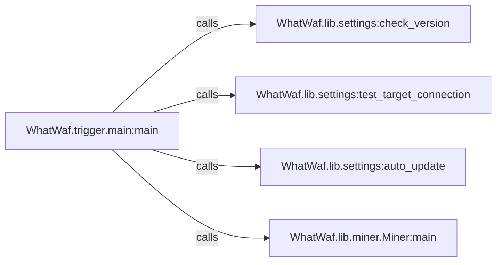

## Component Details

The WhatWaf tool identifies Web Application Firewalls (WAFs) protecting a target URL. The process begins with the `main` function in `WhatWaf/trigger/main.py`, which acts as the entry point. It first checks the tool's version against a remote server using `check_version` to determine if an update is needed. Next, it verifies the connection to the target URL using `test_target_connection`. If an update is available, `auto_update` is called to update the tool. Finally, the core WAF detection logic is executed by calling the `main` function in `WhatWaf/lib/miner.py`. This function employs various techniques to analyze the target and identify the WAF based on its characteristics.

### WhatWaf.trigger.main:main
This is the entry point of the WhatWaf tool. It orchestrates the WAF detection process by calling functions for version checking, target connection testing, auto-updating, and the main miner function.
- **Related Classes/Methods**: `WhatWaf.trigger.main:main`

### WhatWaf.lib.settings:check_version
This function checks the current version of the WhatWaf tool against a remote server to determine if an update is available.
- **Related Classes/Methods**: `WhatWaf.lib.settings:check_version`

### WhatWaf.lib.settings:test_target_connection
This function tests the connection to the target URL to ensure that it is reachable before proceeding with the WAF detection process.
- **Related Classes/Methods**: `WhatWaf.lib.settings:test_target_connection`

### WhatWaf.lib.settings:auto_update
This function automatically updates the WhatWaf tool to the latest version if an update is available.
- **Related Classes/Methods**: `WhatWaf.lib.settings:auto_update`

### WhatWaf.lib.miner.Miner:main
This is the core function responsible for detecting and analyzing the WAF protecting the target URL. It likely employs various techniques to identify the WAF based on its behavior and characteristics.
- **Related Classes/Methods**: `WhatWaf.lib.miner.Miner:main`