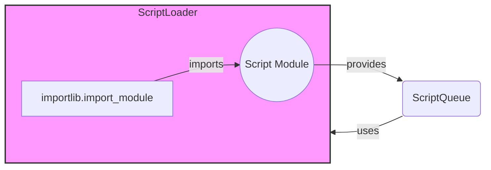

### Component Description

This diagram illustrates the role of the `ScriptLoader` in dynamically importing script modules and making them available to the `ScriptQueue`. The `ScriptLoader` utilizes `importlib.import_module` to import script modules, which are then used by the `ScriptQueue` for WAF detection.

