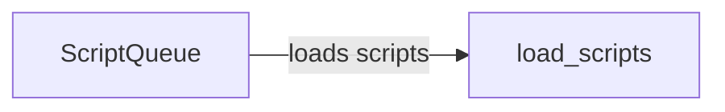

## Component Details

The Script Loader component is responsible for managing and loading JavaScript files (detection scripts) into a web page. It uses a queue to maintain the order of scripts and dynamically adds them to the document's head. This ensures that the scripts are loaded and executed in the correct sequence, enabling the application to perform its detection tasks effectively.

### ScriptQueue
The ScriptQueue class manages a queue of JavaScript files to be loaded into a web page. It provides methods for adding scripts to the queue and loading them in the correct order. The queue ensures that scripts are loaded sequentially, which is important for maintaining dependencies and avoiding conflicts.
- **Related Classes/Methods**: `WhatWaf.content.ScriptQueue`

### load_scripts
The load_scripts method is responsible for loading the scripts from the queue into the web page. It iterates through the script queue, creates script elements, sets their source URLs, and appends them to the document's head. This dynamically adds the scripts to the page, allowing them to be executed.
- **Related Classes/Methods**: `WhatWaf.content.ScriptQueue.load_scripts`