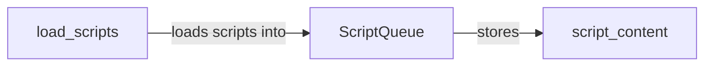

## Component Details

The Script Loader component is responsible for loading and managing JavaScript scripts used by the WhatWaf tool. It provides a mechanism to load scripts from files or directories, store their content, and make them available for execution. The central class is `ScriptQueue`, which maintains a collection of scripts and offers methods to load and access them. The `load_scripts` method handles the actual loading process, reading script content from the specified sources and storing it in the `ScriptQueue`. The loaded scripts, represented as `script_content`, are then used for various detection or analysis tasks within the WhatWaf framework.

### ScriptQueue
The `ScriptQueue` class manages a collection of JavaScript scripts. It provides methods for loading scripts from files or directories, storing their content, and accessing them when needed. It uses a dictionary to store the scripts with their names as keys.
- **Source Reference**: `WhatWaf.content.ScriptQueue`
  - *File*: `WhatWaf/content/ScriptQueue.py`

### load_scripts
The `load_scripts` method is responsible for loading JavaScript scripts from a given source (e.g., a file or directory). It reads the script content and stores it within the `ScriptQueue` for later use. It handles both individual files and directories containing script files.
- **Source Reference**: `WhatWaf.content.ScriptQueue:load_scripts`
  - *File*: `WhatWaf/content/ScriptQueue.py`

### script_content
Represents the actual JavaScript code loaded from the script files. This content is stored and managed by the `ScriptQueue`.
- **Source Reference**: `WhatWaf.content.ScriptQueue:scripts`
  - *File*: `WhatWaf/content/ScriptQueue.py`