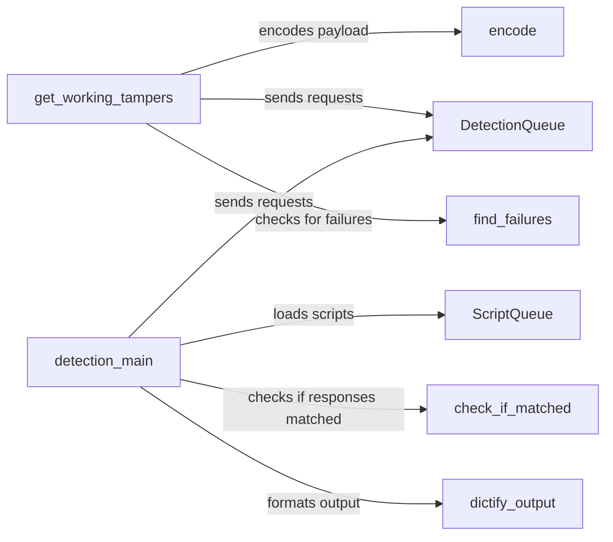

## Component Details

The WhatWaf system detects web application firewalls (WAFs) by sending HTTP requests with various payloads and analyzing the responses. It loads detection scripts and tamper scripts to identify firewalls and bypass their protections. The system then formats the detection results into a JSON format.

### ScriptQueue
The ScriptQueue class is responsible for loading scripts from a specified directory. It iterates through files in a directory, imports them as modules, and adds them to a list. It is used to load both detection plugins and tamper scripts.
- **Related Classes/Methods**: ``WhatWaf.content.ScriptQueue` (0:0)`, ``WhatWaf.content.ScriptQueue.__init__` (0:0)`, ``WhatWaf.content.ScriptQueue.load_scripts` (0:0)`

### DetectionQueue
The DetectionQueue class manages the process of sending HTTP requests with various payloads to a given URL. It handles both normal and threaded requests, including setting headers, proxies, and timeouts. It also saves fingerprints of responses and manages potential network-level firewall detections.
- **Related Classes/Methods**: ``WhatWaf.content.DetectionQueue` (0:0)`, ``WhatWaf.content.DetectionQueue.__init__` (0:0)`, ``WhatWaf.content.DetectionQueue.get_response` (0:0)`, ``WhatWaf.content.DetectionQueue.threader` (0:0)`, ``WhatWaf.content.DetectionQueue.threaded_get_response_helper` (0:0)`, ``WhatWaf.content.DetectionQueue.threaded_get_response` (0:0)`

### encode
The encode function is responsible for encoding a given payload using a specified tamper script. It imports the tamper script as a module and then calls the tamper function within that script to encode the payload.
- **Related Classes/Methods**: ``WhatWaf.content.encode` (0:0)`

### find_failures
The find_failures function checks for failures in the response content by searching for specific regular expressions. It returns True if any of the regular expressions are found in the HTML content or if the HTML content is empty or None.
- **Related Classes/Methods**: ``WhatWaf.content.find_failures` (0:0)`

### get_working_tampers
The get_working_tampers function identifies tamper scripts that successfully bypass a web application firewall (WAF). It loads tamper scripts using ScriptQueue, sends requests with tampered payloads, and checks for failures in the responses. It returns a set of working tamper scripts.
- **Related Classes/Methods**: ``WhatWaf.content.get_working_tampers` (0:0)`

### check_if_matched
The check_if_matched function compares the normal response with the payload response to verify if there is protection on the target. It compares headers and status codes and returns a set of differences or None if the responses are similar enough.
- **Related Classes/Methods**: ``WhatWaf.content.check_if_matched` (0:0)`

### dictify_output
The dictify_output function formats the detection results into a JSON format. It takes the URL, identified firewalls, and working tampers as input and returns a JSON string containing this information.
- **Related Classes/Methods**: ``WhatWaf.content.dictify_output` (0:0)`

### detection_main
The detection_main function is the main function for detecting web application firewalls (WAFs). It orchestrates the entire detection process, including gathering HTTP responses, loading firewall detection scripts, running detection checks, and performing bypass analysis. It uses other functions and classes to achieve this.
- **Related Classes/Methods**: ``WhatWaf.content.detection_main` (0:0)`