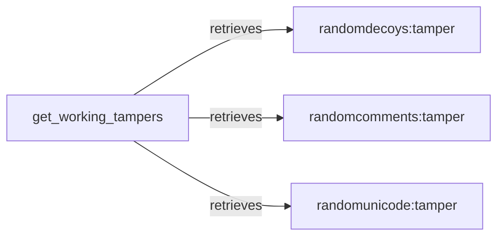

## Component Details

The Tamper Engine modifies HTTP requests to bypass firewalls or trigger vulnerabilities. It retrieves a list of available tamper functions, applies them to the original request, and sends the modified request to the target. This process tests the WAF's response to various potentially malicious inputs, allowing for the identification of weaknesses and vulnerabilities.

### get_working_tampers
This function is responsible for retrieving a list of available tamper functions that can be applied to the request. It likely filters or selects tampers based on certain criteria, such as compatibility or configuration settings. This ensures that only appropriate tampers are used for a given request.
- **Related Classes/Methods**: `WhatWaf.content:get_working_tampers`

### randomdecoys:tamper
This function implements a tamper technique that adds random decoy parameters or values to the request. This can help to obfuscate the actual malicious payload and evade WAF detection by making the request appear less suspicious.
- **Related Classes/Methods**: `WhatWaf.content.tampers.randomdecoys:tamper`

### randomcomments:tamper
This function implements a tamper technique that adds random comments to the request. This can help to break up the structure of the request and evade WAF detection by disrupting pattern matching or other analysis techniques used by the WAF.
- **Related Classes/Methods**: `WhatWaf.content.tampers.randomcomments:tamper`

### randomunicode:tamper
This function implements a tamper technique that adds random unicode characters to the request. This can help to obfuscate the actual malicious payload and evade WAF detection by introducing unexpected characters that may not be properly handled by the WAF.
- **Related Classes/Methods**: `WhatWaf.content.tampers.randomunicode:tamper`