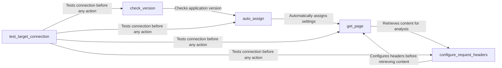

## Component Details

The Target Configuration subsystem in WhatWaf is responsible for setting up and validating the environment before initiating a web application firewall (WAF) detection scan. It involves configuring request headers, testing the connection to the target, and performing version checks to ensure compatibility and proper setup. This subsystem ensures that WhatWaf is correctly configured to interact with the target website, handling tasks such as setting user agents, verifying connectivity, and managing settings based on the environment.

### get_page
This component retrieves the content of a specified web page. It's a fundamental function for fetching the target website's HTML, which is subsequently analyzed for security vulnerabilities. It uses the configured request headers and handles potential connection errors, ensuring the retrieval of the page content for further analysis.
- **Related Classes/Methods**: `WhatWaf.lib.settings:get_page`

### configure_request_headers
This component configures the headers for HTTP requests made by WhatWaf. It allows the application to mimic different user agents or add custom headers, which can be important for bypassing certain security measures or accurately simulating real-world traffic. It sets up the user agent and any other necessary headers to ensure proper communication with the target.
- **Related Classes/Methods**: `WhatWaf.lib.settings:configure_request_headers`

### auto_assign
This component automatically assigns values to certain settings based on the environment or other factors. This simplifies the configuration process and reduces the need for manual intervention. It handles things like default timeout values or other environment-specific settings, ensuring that the application is properly configured for the specific environment in which it is running.
- **Related Classes/Methods**: `WhatWaf.lib.settings:auto_assign`

### check_version
This component checks the current version of the WhatWaf application. This is important for ensuring that the application is up-to-date and that any known security vulnerabilities are patched. It likely compares the current version against a remote source or a local file, ensuring that the application is running the latest version with all necessary security patches.
- **Related Classes/Methods**: `WhatWaf.lib.settings:check_version`

### test_target_connection
This component tests the connection to the target website to ensure that it is reachable. This is a preliminary step to verify that the application can communicate with the target before initiating any security assessments. It sends a simple request to the target and checks for a successful response, ensuring that the target is reachable and the application can communicate with it.
- **Related Classes/Methods**: `WhatWaf.lib.settings:test_target_connection`