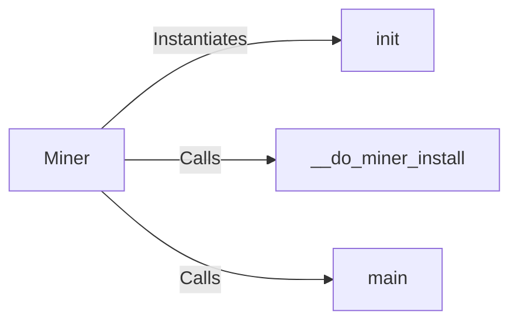

## Component Details

The Vulnerability Discovery component in WhatWaf leverages external vulnerability miners to identify potential weaknesses in web applications. The core of this component is the `Miner` class, which manages the installation, configuration, and execution of individual miner modules. The `init` method initializes the miner, setting up the environment. The `__do_miner_install` method handles the installation of dependencies required by the miner. The `main` method serves as the entry point for the miner's execution, orchestrating the WAF detection process by calling other modules and functions to perform the actual vulnerability detection.

### Miner
The Miner class is the central component, responsible for managing the installation and execution of individual miner modules. It handles the setup and coordination of the WAF detection process.
- **Related Classes/Methods**: `WhatWaf.lib.miner.Miner`

### __do_miner_install
This method handles the installation of the miner's dependencies. It likely uses pip or a similar package manager to install required packages.
- **Related Classes/Methods**: `WhatWaf.lib.miner.Miner.__do_miner_install`

### init
The init method is responsible for initializing the Miner class, setting up the environment and any necessary configurations.
- **Related Classes/Methods**: `WhatWaf.lib.miner.Miner.init`

### main
The main method is the entry point for the miner's execution. It orchestrates the WAF detection process, potentially calling other modules and functions to perform the actual detection.
- **Related Classes/Methods**: `WhatWaf.lib.miner.Miner.main`