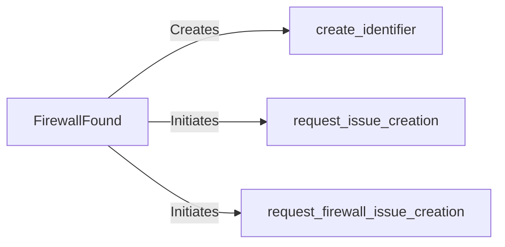

## Component Details

The WAF Detection component identifies and reports detected web application firewalls (WAFs). It analyzes the responses received from the target to determine the presence and type of WAF. The core functionality revolves around the `FirewallFound` class, which encapsulates the details of a detected firewall. This class is responsible for creating unique identifiers for each detection and initiating the process of creating issues related to the detection. The component interacts with other parts of the system by receiving network responses, analyzing them for WAF signatures, and then reporting the findings through issue creation.

### FirewallFound
Represents a detected firewall. It stores information about the detected firewall, creates unique identifiers for each detection, and initiates the process of creating issues related to the detection.
- **Related Classes/Methods**: `WhatWaf.lib.firewall_found.FirewallFound`

### create_identifier
Generates a unique identifier for a specific firewall detection. This identifier helps in tracking and managing individual detections.
- **Related Classes/Methods**: `WhatWaf.lib.firewall_found.FirewallFound.create_identifier`, `WhatWaf.lib.firewall_found:create_identifier`

### request_issue_creation
Initiates the process of creating a general issue (likely a bug report or alert) related to a firewall detection. This might involve sending data to an issue tracking system or logging the issue.
- **Related Classes/Methods**: `WhatWaf.lib.firewall_found.FirewallFound.request_issue_creation`, `WhatWaf.lib.firewall_found:request_issue_creation`

### request_firewall_issue_creation
Specifically requests the creation of a firewall-related issue. This function likely contains logic specific to firewall issues, such as formatting the issue description or assigning it to a relevant team.
- **Related Classes/Methods**: `WhatWaf.lib.firewall_found.FirewallFound.request_firewall_issue_creation`