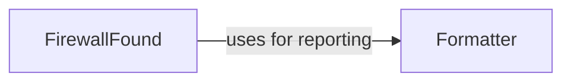

## Component Details

The WAF Identification and Reporting component identifies web application firewalls (WAFs) by analyzing HTTP responses and other data. It creates unique identifiers for detected WAFs and reports them, potentially triggering issue creation in a tracking system. The component leverages configuration settings and utilizes a formatter for standardized output and logging.

### FirewallFound
The FirewallFound component is responsible for managing and reporting identified firewalls. It includes functionalities for creating unique identifiers for found firewalls and requesting the creation of issues (likely in a ticketing system) related to these firewalls.
- **Related Classes/Methods**: `WhatWaf.lib.firewall_found` (full file reference), `WhatWaf.lib.firewall_found:create_identifier` (18:24), `WhatWaf.lib.firewall_found:request_issue_creation` (101:164), `WhatWaf.lib.firewall_found:request_firewall_issue_creation` (167:235)

### Formatter
The Formatter component provides a set of functions for standardized output formatting, including different levels of verbosity (info, debug, warn, error, fatal) and specific formatting for payloads, successful operations, and discovered items. It likely serves as a central point for logging and displaying information to the user.
- **Related Classes/Methods**: `WhatWaf.lib.formatter:info` (29:32), `WhatWaf.lib.formatter:debug` (35:38), `WhatWaf.lib.formatter:warn` (41:49), `WhatWaf.lib.formatter:error` (52:55), `WhatWaf.lib.formatter:fatal` (58:61), `WhatWaf.lib.formatter:payload` (64:67), `WhatWaf.lib.formatter:success` (70:73), `WhatWaf.lib.formatter:discover` (87:90)