```mermaid
graph LR
    Core_Engine["Core Engine"]
    Configuration_Manager["Configuration Manager"]
    Payload_Manager["Payload Manager"]
    Request_Dispatcher["Request Dispatcher"]
    Response_Analyzer["Response Analyzer"]
    Database_Manager["Database Manager"]
    Miner["Miner"]
    Output_Formatter["Output Formatter"]
    Core_Engine -- "configures" --> Configuration_Manager
    Core_Engine -- "manages payloads" --> Payload_Manager
    Core_Engine -- "dispatches requests" --> Request_Dispatcher
    Core_Engine -- "analyzes responses" --> Response_Analyzer
    Core_Engine -- "manages database" --> Database_Manager
    Core_Engine -- "mines new signatures" --> Miner
    Core_Engine -- "formats output" --> Output_Formatter
    Response_Analyzer -- "uses" --> Configuration_Manager
    Database_Manager -- "provides payloads to" --> Request_Dispatcher
    Payload_Manager -- "encodes payloads using" --> Request_Dispatcher
    Request_Dispatcher -- "sends requests using" --> Payload_Manager
    Response_Analyzer -- "identifies firewalls from responses of" --> Request_Dispatcher
    Database_Manager -- "inserts data into" --> Response_Analyzer
    Miner -- "mines for" --> Database_Manager
    Output_Formatter -- "formats output for" --> Configuration_Manager
    Output_Formatter -- "formats output for" --> Payload_Manager
    Output_Formatter -- "formats output for" --> Request_Dispatcher
    Output_Formatter -- "formats output for" --> Response_Analyzer
    Output_Formatter -- "formats output for" --> Database_Manager
    Output_Formatter -- "formats output for" --> Miner
    Configuration_Manager -- "uses" --> Output_Formatter
    click Core_Engine href "https://github.com/CodeBoarding/GeneratedOnBoardings/blob/main/WhatWaf/Core Engine.md" "Details"
    click Configuration_Manager href "https://github.com/CodeBoarding/GeneratedOnBoardings/blob/main/WhatWaf/Configuration Manager.md" "Details"
    click Payload_Manager href "https://github.com/CodeBoarding/GeneratedOnBoardings/blob/main/WhatWaf/Payload Manager.md" "Details"
    click Request_Dispatcher href "https://github.com/CodeBoarding/GeneratedOnBoardings/blob/main/WhatWaf/Request Dispatcher.md" "Details"
    click Response_Analyzer href "https://github.com/CodeBoarding/GeneratedOnBoardings/blob/main/WhatWaf/Response Analyzer.md" "Details"
    click Database_Manager href "https://github.com/CodeBoarding/GeneratedOnBoardings/blob/main/WhatWaf/Database Manager.md" "Details"
    click Miner href "https://github.com/CodeBoarding/GeneratedOnBoardings/blob/main/WhatWaf/Miner.md" "Details"
    click Output_Formatter href "https://github.com/CodeBoarding/GeneratedOnBoardings/blob/main/WhatWaf/Output Formatter.md" "Details"
```

## Component Details

WhatWaf is a tool designed to identify and analyze Web Application Firewalls (WAFs). It operates by sending a series of crafted HTTP requests to a target URL and analyzing the responses to detect the presence and type of WAF. The tool uses a database of known WAF signatures and payloads, along with various encoding and tampering techniques, to bypass WAF rules and accurately identify the firewall in use. The core functionality involves configuring settings, managing payloads, dispatching requests, analyzing responses, and formatting output, all orchestrated by a central controller.

### Core Engine
The Core Engine orchestrates the entire WAF identification process. It initializes and manages the configuration, payload handling, request dispatching, and response analysis components. It serves as the central control point, ensuring that all components work together seamlessly to achieve the tool's objective.
- **Related Classes/Methods**: `WhatWaf.trigger.main`

### Configuration Manager
The Configuration Manager handles the application's settings, target URLs, request headers, timeouts, and auto-update features. It ensures that the application is properly configured before running scans and manages updates to keep the tool current.
- **Related Classes/Methods**: `WhatWaf.lib.settings`

### Payload Manager
The Payload Manager is responsible for managing and encoding the payloads used to test the target. It interacts with tamper scripts to modify payloads and evade WAF detection. It also manages the script queue.
- **Related Classes/Methods**: `WhatWaf.content`, `WhatWaf.content.tampers.*`, `WhatWaf.content.ScriptQueue`

### Request Dispatcher
The Request Dispatcher manages the queue of requests to be sent to the target. It handles threading and retrieves responses from the target, ensuring efficient and concurrent scanning.
- **Related Classes/Methods**: `WhatWaf.content.DetectionQueue`

### Response Analyzer
The Response Analyzer examines the responses from the target to identify the WAF in use. It creates identifiers based on response characteristics and requests issue creation, providing insights into the security measures implemented by the web application.
- **Related Classes/Methods**: `WhatWaf.lib.firewall_found`

### Database Manager
The Database Manager handles the storage and retrieval of payloads and URLs. It provides functions for inserting new payloads and URLs into the database, ensuring that the tool has access to the necessary data for scanning.
- **Related Classes/Methods**: `WhatWaf.lib.database`

### Miner
The Miner component is responsible for mining new WAF signatures and payloads. It includes functionalities for installing the miner and running the main mining process, expanding the tool's capabilities for identifying and analyzing WAFs.
- **Related Classes/Methods**: `WhatWaf.lib.miner.Miner`

### Output Formatter
The Output Formatter handles the formatting of output messages, including info, debug, warning, error, fatal, payload, success, and discover messages. It ensures that the tool's output is clear, concise, and easy to understand.
- **Related Classes/Methods**: `WhatWaf.lib.formatter`