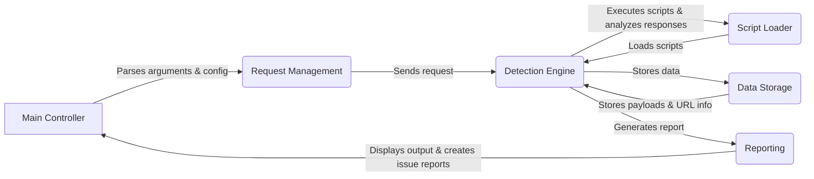

## WhatWaf: High-Level Data Flow Overview

WhatWaf is a security tool designed to detect and identify Web Application Firewalls (WAFs) protecting a given website. It operates by sending a series of crafted HTTP requests, analyzing the responses, and comparing them against a database of known WAF signatures. The tool also supports the use of tamper scripts to bypass potential WAF protections and improve detection accuracy.

## Component Descriptions

**Main Controller:** This component serves as the entry point of the application. It's responsible for parsing command-line arguments, loading configurations, and orchestrating the overall WAF detection process. It initializes the `Request Management` component to start sending HTTP requests and receives the final report from the `Reporting` component.

**Request Management:** This component handles the construction and sending of HTTP requests to the target website. It configures request headers, validates URLs, and manages the communication with the web server. It receives instructions from the `Main Controller` and sends requests to the `Detection Engine`.

**Detection Engine:** This is the core component responsible for executing detection scripts and analyzing the responses to identify WAFs. It manages a queue of scripts and tamper scripts to bypass potential WAF protections. It interacts with the `Script Loader` to load the necessary scripts, the `Data Storage` to store data, and the `Reporting` component to generate reports.

**Script Loader:** This component is responsible for loading and managing the detection scripts used by the `Detection Engine`. It reads scripts from files or a database and makes them available for execution. It provides scripts to the `Detection Engine`.

**Data Storage:** This component manages the storage and retrieval of payloads and URL information in a database. It stores data generated by the `Detection Engine` and provides it when needed. It interacts with the `Detection Engine`.

**Reporting:** This component formats and displays the application's output, including errors, warnings, and successful detections. It also handles the creation of firewall issue reports. It receives data from the `Detection Engine` and presents it to the user, also sending the final report to the `Main Controller`.