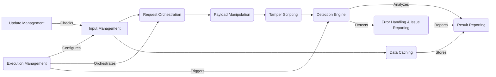

Okay, I'm ready to generate the high-level data flow overview for the `WhatWaf` project.

**1. Project Description:**

WhatWaf is a web application firewall (WAF) detection tool. It identifies the presence and type of WAF protecting a website by sending a series of HTTP requests with specially crafted payloads and analyzing the responses. The tool aims to help security professionals and researchers understand the security posture of web applications.

**2. Data Flow Diagram (Mermaid Format):**

**3. Component Descriptions:**

*   **Input Management:** This component handles the parsing of command-line arguments, configuration files, and user input. It configures the scan based on user-specified options and target information. It relates to `Request Orchestration` by providing the target URL and scan settings, and to `Execution Management` by receiving the initial configuration.

*   **Request Orchestration:** This component manages the sending of HTTP requests to the target. It configures headers, proxies, and handles different request types (GET, POST). It receives the target URL and scan settings from `Input Management` and sends requests with payloads generated by `Payload Manipulation`.

*   **Payload Manipulation:** This component generates, encodes, and manages the payloads used to detect web application firewalls and vulnerabilities. It receives instructions from `Request Orchestration` and provides payloads to `Tamper Scripting` or `Detection Engine`.

*   **Tamper Scripting:** This component loads and applies tamper scripts to modify payloads, attempting to bypass detected firewalls. It receives payloads from `Payload Manipulation` and provides modified payloads to the `Detection Engine`.

*   **Detection Engine:** This is the core component that sends payloads to the target, analyzes the responses, and identifies potential web application firewalls. It receives payloads from `Payload Manipulation` or `Tamper Scripting` and sends the requests via `Request Orchestration`. It then analyzes the responses and reports findings to `Result Reporting` and `Error Handling & Issue Reporting`.

*   **Result Reporting:** This component formats and presents the scan results, including identified firewalls, bypasses, and other relevant information. It also handles saving the output to various file formats. It receives scan results from the `Detection Engine`, stores data in `Data Caching`, and reports errors from `Error Handling & Issue Reporting`.

*   **Data Caching:** This component manages the caching of URLs, payloads, and scan results in a database for future use. It receives data from `Result Reporting` and provides data to other components as needed.

*   **Error Handling & Issue Reporting:** This component handles exceptions and errors during the scan process and reports potential firewall detection issues. It receives error information from the `Detection Engine` and reports issues to `Result Reporting`.

*   **Update Management:** This component checks for and applies updates to the WhatWaf tool. It checks for updates and configures `Input Management` with the latest settings.

*   **Execution Management:** This component is the main entry point that orchestrates the entire workflow of the WhatWaf tool, from parsing arguments to running the detection and reporting results. It configures `Input Management`, orchestrates `Request Orchestration`, and triggers the `Detection Engine`.