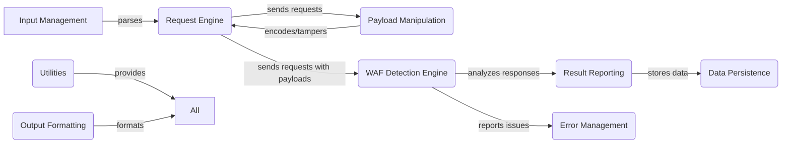

## WhatWaf: High-Level Data Flow Diagram

WhatWaf is a security tool designed to detect and identify Web Application Firewalls (WAFs) protecting a given website. It operates by sending a series of crafted HTTP requests with various payloads designed to trigger WAF rules. By analyzing the responses, WhatWaf can fingerprint the WAF in use and potentially identify bypass methods.

### Component Descriptions:

**A. Input Management:** This component handles user input, parsing command-line arguments, Burp request files, and Googler files to extract target URLs and other settings. It parses the input and passes the relevant information to the Request Engine.

**B. Request Engine:** This component configures and executes HTTP requests based on the payloads provided by the Payload Manipulation component. It manages headers, proxies, Tor connections, request throttling, and timeouts. It sends the crafted requests to the target and receives responses, which are then passed to the WAF Detection Engine.

**C. Payload Manipulation:** This component manages and encodes payloads, applying tamper scripts to bypass WAFs, and exports payloads to various formats. It provides the payloads to the Request Engine and receives tamper scripts from the WAF Detection Engine.

**D. WAF Detection Engine:** This component contains the core logic for detecting WAFs. It sends payloads via the Request Engine, analyzes the responses, and identifies potential bypasses using detection and tamper scripts. It receives requests from the Request Engine and interacts with the Result Reporting component to report findings. It also interacts with the Error Management component to report any errors encountered during the detection process.

**E. Result Reporting:** This component handles the results of the WAF detection process, displaying cached data, producing reports, and writing output to files in various formats. It receives data from the WAF Detection Engine and interacts with the Data Persistence component to store results.

**F. Data Persistence:** This component interacts with the database to store and retrieve URLs, payloads, and detection results, providing caching functionality. It supports the Result Reporting component by providing cached data and stores the results reported by the Result Reporting component.

**G. Error Management:** This component handles errors and exceptions, reports issues to a remote service, and saves temporary issue files. It supports all components by providing centralized error handling and reporting. The WAF Detection Engine reports issues to this component.

**H. Utilities:** This component provides utility functions for generating random strings, shuffling lists, and checking the current version of WhatWaf. It supports various components by providing common functionalities.

**I. Output Formatting:** This component provides functions for formatting output messages with different levels of severity (info, warn, error, etc.). It supports all components by providing consistent output formatting.