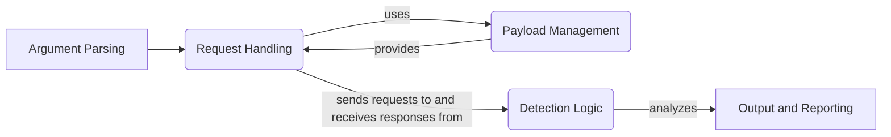

## WhatWaf: High-Level Data Flow Diagram

WhatWaf is a security tool designed to identify Web Application Firewalls (WAFs) protecting a given website. It operates by sending various HTTP requests with potentially malicious payloads and analyzing the responses to detect patterns indicative of specific WAFs.

## Component Descriptions

**Argument Parsing:** This component (`lib.cmd.WhatWafParser`) is responsible for parsing command-line arguments provided by the user. It configures the application's behavior, such as target URL, number of threads, proxy settings, and output options. It relates to `Request Handling` by providing the target URL and other settings needed to initiate HTTP requests.

**Request Handling:** This component (`content.DetectionQueue`, `lib.settings.get_page`) manages the process of sending HTTP requests to the target website and receiving responses. It handles threading, proxy settings, and other network-related configurations. It uses `Payload Management` to generate the payloads to be sent in the requests and sends the requests to `Detection Logic` for analysis.

**Payload Management:** This component (`content.encode`, `content.tampers`) is responsible for managing the payloads used for WAF detection. It includes encoding and tampering techniques to bypass potential WAF filters. It provides payloads to `Request Handling` to be included in the HTTP requests.

**Detection Logic:** This component (`content.detection_main`, `content.ScriptQueue`) contains the core logic for detecting WAFs. It analyzes the HTTP responses received from the target website, applies detection scripts, and identifies potential WAFs based on the response patterns. It receives requests from `Request Handling` and sends the analysis results to `Output and Reporting`.

**Output and Reporting:** This component (`lib.formatter`, `lib.settings.create_fingerprint`, `lib.firewall_found.request_firewall_issue_creation`) formats and outputs the results of the WAF detection process. It includes saving fingerprints of detected WAFs, creating reports, and displaying the results to the user. It receives the detection results from `Detection Logic` and presents them in a user-friendly format.