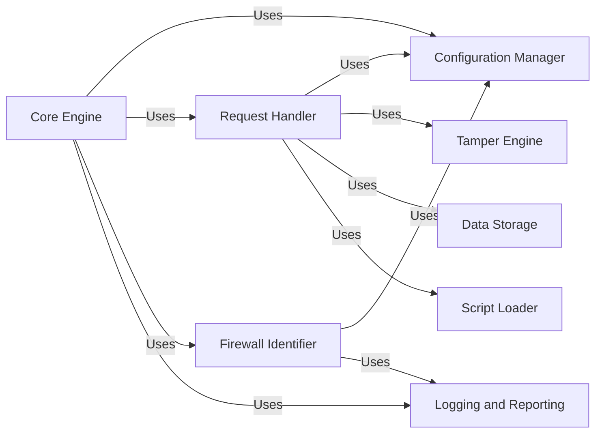

## Component Details

WhatWaf is a tool designed to identify Web Application Firewalls (WAFs) protecting a target URL. It operates by sending a series of HTTP requests, potentially with modified payloads, and analyzing the responses to detect the presence and type of WAF. The tool manages configurations, handles requests, identifies firewalls, and logs the results.

### Core Engine
The Core Engine orchestrates the WAF detection process. It initializes settings, loads detection scripts, manages the request queue, and coordinates the analysis of responses. It serves as the central driver for the entire application, managing the interaction between other components to achieve the goal of identifying the WAF in use.
- **Related Classes/Methods**: `WhatWaf.trigger.main:main`, `WhatWaf.content:detection_main`

### Configuration Manager
The Configuration Manager handles application settings, configures request headers, and manages target testing, version checking, and auto-updates. It provides a centralized point for managing the application's configuration, ensuring that the application is properly configured before the detection process begins. This includes setting up request headers, testing the target connection, and checking for updates.
- **Related Classes/Methods**: `WhatWaf.lib.settings:get_page`, `WhatWaf.lib.settings:configure_request_headers`, `WhatWaf.lib.settings:produce_results`, `WhatWaf.lib.settings:auto_assign`, `WhatWaf.lib.settings:create_fingerprint`, `WhatWaf.lib.settings:check_version`, `WhatWaf.lib.settings:test_target_connection`, `WhatWaf.lib.settings:auto_update`

### Request Handler
The Request Handler is responsible for sending HTTP requests to the target and retrieving the responses. It manages the request queue, handles threading for concurrent requests, and provides helper functions for retrieving responses. This component is crucial for interacting with the target server and gathering the necessary data for WAF detection.
- **Related Classes/Methods**: `WhatWaf.content.DetectionQueue:get_response`, `WhatWaf.content.DetectionQueue:threader`, `WhatWaf.content.DetectionQueue:threaded_get_response_helper`, `WhatWaf.content.DetectionQueue:threaded_get_response`

### Tamper Engine
The Tamper Engine implements techniques to modify requests, likely to bypass firewalls or trigger vulnerabilities. It applies various tampering methods to the original request before it is sent to the target. This allows the tool to test how the WAF responds to different types of potentially malicious input.
- **Related Classes/Methods**: `WhatWaf.content.tampers.randomdecoys:tamper`, `WhatWaf.content.tampers.randomcomments:tamper`, `WhatWaf.content.tampers.randomunicode:tamper`

### Firewall Identifier
The Firewall Identifier focuses on identifying firewalls based on responses and creating related issues or reports. It analyzes the responses received from the target and attempts to identify the presence and type of WAF being used. This component is responsible for the core functionality of the tool: detecting the WAF.
- **Related Classes/Methods**: `WhatWaf.lib.firewall_found:create_identifier`, `WhatWaf.lib.firewall_found:request_issue_creation`, `WhatWaf.lib.firewall_found:request_firewall_issue_creation`

### Data Storage
The Data Storage component handles storing payloads and URLs, likely for tracking or analysis of requests and responses during the WAF detection process. It provides a mechanism for persisting data related to the detection process, which can be useful for debugging or further analysis.
- **Related Classes/Methods**: `WhatWaf.lib.database:insert_payload`, `WhatWaf.lib.database:insert_url`

### Logging and Reporting
The Logging and Reporting component provides formatting and logging functionalities for consistent output and debugging. It ensures that all events and errors are properly logged and reported, providing valuable information for understanding the tool's behavior and diagnosing any issues.
- **Related Classes/Methods**: `WhatWaf.lib.formatter:info`, `WhatWaf.lib.formatter:debug`, `WhatWaf.lib.formatter:warn`, `WhatWaf.lib.formatter:error`, `WhatWaf.lib.formatter:fatal`

### Script Loader
The Script Loader is responsible for loading and managing the detection scripts used by the application. It ensures that the scripts are properly loaded and available for use during the detection process. These scripts likely contain the specific payloads and techniques used to identify different WAFs.
- **Related Classes/Methods**: `WhatWaf.content.ScriptQueue:load_scripts`