## WhatWaf: High-Level Data Flow Overview

WhatWaf is a security tool designed to detect Web Application Firewalls (WAFs) protecting a given website. It operates by sending a series of crafted HTTP requests, using various payloads and techniques, to identify the presence and type of WAF. The tool analyzes the responses to these requests, comparing them against known WAF signatures and behaviors to determine if a WAF is present.

```mermaid
graph LR
    A[Main Execution] --> B(Request Management) 
    A --> E(Output and Reporting)
    B -- "sends" --> C(Detection Logic)
    C -- "analyzes" --> B
    C -- "stores" --> D(Database Interaction)
    D -- "provides" --> C
    E -- "uses" --> D
    E -- "reports" --> A













































































































































































































































































































































































































































































































































































































































































































































































































































































































































































































































































































































































































































































































































































































































































































































































































































































































































































































































































































































































































































































































































































































































































































































































































































































































































































































































































































































































































































































































































































































































































































































































































































































































```

Each component is described below:

*   **Main Execution:** This component serves as the entry point of the application. It initializes the program, parses command-line arguments, and orchestrates the overall WAF detection process. It interacts with the `Request Management` component to initiate HTTP requests and receives reports from the `Output and Reporting` component.
*   **Request Management:** This component is responsible for constructing and sending HTTP requests to the target website. It configures request headers and handles responses. It receives instructions from the `Main Execution` component and sends requests based on the `Detection Logic` component. It also analyzes the responses received from the target website and passes the responses back to the `Detection Logic` component.
*   **Detection Logic:** This component contains the core logic for detecting WAFs. It uses a variety of scripts and techniques to analyze HTTP responses and identify WAF signatures. It receives HTTP responses from the `Request Management` component and interacts with the `Database Interaction` component to retrieve and store data related to payloads and WAF identification. It also sends requests to the `Request Management` component to perform further analysis.
*   **Database Interaction:** This component manages the storage and retrieval of data related to payloads, URLs, and identified WAFs. It interacts with the `Detection Logic` component to store and retrieve data used in the detection process. It also provides data to the `Output and Reporting` component for generating reports.
*   **Output and Reporting:** This component formats and displays the application's output, including informational messages, warnings, errors, and detected firewalls. It also handles the reporting of detected firewall issues. It receives data from the `Main Execution` component and the `Database Interaction` component and reports back to the `Main Execution` component.