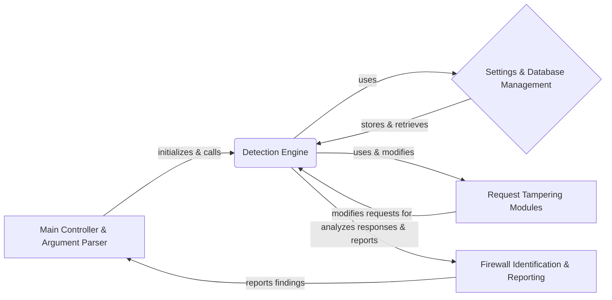

## WhatWaf: High-Level Data Flow Overview

WhatWaf is a security tool designed to detect and identify Web Application Firewalls (WAFs). It sends various HTTP requests, analyzes the responses, and uses a database of known WAF signatures to determine if a WAF is present and, if so, which one.

## Component Descriptions

**1. Main Controller & Argument Parser:**
This component is responsible for initializing the WhatWaf tool, parsing command-line arguments provided by the user, and orchestrating the overall workflow. It calls the Detection Engine to start the WAF detection process and receives the final report from the Firewall Identification & Reporting component.

**2. Detection Engine:**
This is the core component that performs the actual WAF detection. It uses settings and configurations from the Settings & Database Management component to craft HTTP requests. It also utilizes Request Tampering Modules to modify requests and test for vulnerabilities. The Detection Engine sends requests, analyzes responses, and passes the results to the Firewall Identification & Reporting component.

**3. Settings & Database Management:**
This component manages all settings, configurations, and database interactions. It initializes the database, stores and retrieves data related to payloads, URLs, and scan results. The Detection Engine uses this component to retrieve settings and store scan results.

**4. Firewall Identification & Reporting:**
This component identifies firewalls based on the responses received by the Detection Engine. It analyzes the responses and creates issues based on the findings. It then reports these findings back to the Main Controller & Argument Parser for final output.

**5. Request Tampering Modules:**
This component contains modules for tampering with requests to bypass firewalls. These modules are used by the Detection Engine to modify requests and test for vulnerabilities. The Detection Engine uses these modules to craft different types of requests to identify WAFs effectively.