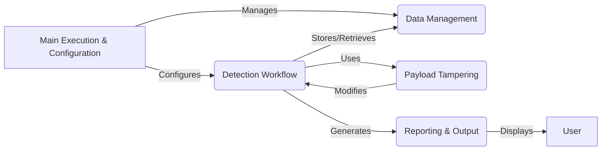

## WhatWaf: High-Level Data Flow Diagram

WhatWaf is a security tool designed to detect web application firewalls (WAFs). It operates by sending various payloads to a target URL and analyzing the responses to identify the presence and type of WAF.

### Component Descriptions:

**1. Main Execution & Configuration:** This component serves as the application's entry point. It parses command-line arguments, configures the environment, and manages settings such as user agents and proxies. It configures the Detection Workflow component with the target URL and other settings, and it manages the Data Management component for storing and retrieving data.

**2. Detection Workflow:** This component orchestrates the core detection process. It manages payloads, sends HTTP requests to the target, and analyzes the responses to identify potential WAFs. It uses the Payload Tampering component to modify payloads and interacts with the Data Management component to store and retrieve payloads and URLs. Finally, it generates reports through the Reporting & Output component.

**3. Data Management:** This component handles the storage and retrieval of data, including payloads and URLs. It likely uses a local database for caching and persistence. It provides data to the Detection Workflow component and stores data generated by it.

**4. Reporting & Output:** This component formats and displays information to the user, including different verbosity levels. It also creates issues for detected firewalls. It receives data from the Detection Workflow component and presents it to the user.

**5. Payload Tampering:** This component modifies payloads to bypass web application firewalls. It provides modified payloads to the Detection Workflow component.