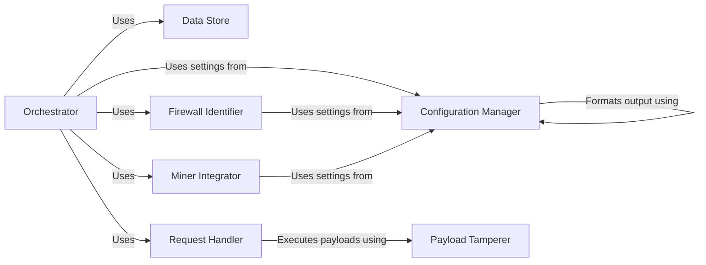

## Component Details

WhatWaf is a tool designed to identify and analyze web application firewalls (WAFs). The tool operates by sending a series of HTTP requests with various payloads to a target URL and analyzing the responses to detect the presence and characteristics of a WAF. It uses a combination of techniques, including payload tampering, response analysis, and integration with external miner tools, to effectively identify and bypass WAFs. The core flow involves configuring the target, crafting and executing payloads, analyzing responses, and reporting identified firewalls.

### Configuration Manager
The Configuration Manager is responsible for handling the tool's settings and configurations. It manages target URLs, request headers, output formatting, and version management. It provides a centralized way to manage global settings and ensures that all components have access to the necessary configuration parameters, allowing for flexible and customizable scans.
- **Related Classes/Methods**: `WhatWaf.lib.settings.Settings`, `WhatWaf.lib.formatter.Formatter`
- **Source Files**: `WhatWaf/lib/settings.py`, `WhatWaf/lib/formatter.py`

### Data Store
The Data Store component manages the storage and retrieval of data, such as payloads, URLs, and scan results. It provides an interface for interacting with the database and ensures data persistence throughout the tool's execution. It is responsible for storing and retrieving payloads and URLs, enabling efficient management of scan data.
- **Related Classes/Methods**: `WhatWaf.lib.database.Database`
- **Source Files**: `WhatWaf/lib/database.py`

### Firewall Identifier
The Firewall Identifier component is responsible for creating unique identifiers for detected firewalls and managing the process of reporting or logging identified firewall issues. It provides a mechanism for tracking and reporting detected WAFs, allowing users to easily identify and analyze the firewalls in place.
- **Related Classes/Methods**: `WhatWaf.lib.firewall_found.FirewallFound`
- **Source Files**: `WhatWaf/lib/firewall_found.py`

### Request Handler
The Request Handler component manages the execution of payloads against the target URL and analyzes the responses to detect WAFs. It includes functionality for managing a queue of scripts to execute, sending requests, and threading. It is responsible for sending requests and analyzing responses, forming the core of the WAF detection process.
- **Related Classes/Methods**: `WhatWaf.content.DetectionQueue.DetectionQueue`, `WhatWaf.content.execute`
- **Source Files**: `WhatWaf/content/DetectionQueue.py`, `WhatWaf/content/__init__.py`

### Payload Tamperer
The Payload Tamperer component handles the encoding and modification of payloads to evade WAF detection. It includes a variety of tampering techniques, such as adding random comments, encoding URLs, and using different character encodings. It is responsible for modifying payloads to bypass WAFs, enhancing the tool's ability to detect firewalls.
- **Related Classes/Methods**: `WhatWaf.content.tampers`
- **Source Files**: `WhatWaf/content/tampers.py`

### Miner Integrator
The Miner Integrator component integrates with a miner tool (likely for discovering new WAF signatures or payloads). It handles the installation and execution of the miner. It is responsible for integrating with external miner tools, expanding the tool's detection capabilities.
- **Related Classes/Methods**: `WhatWaf.lib.miner.Miner`
- **Source Files**: `WhatWaf/lib/miner/Miner.py`

### Orchestrator
The Orchestrator component serves as the entry point for the WhatWaf tool. It orchestrates the execution of the other components, managing the overall workflow of the tool. It is responsible for coordinating the execution of all other components, ensuring a smooth and efficient scan process.
- **Related Classes/Methods**: `WhatWaf.trigger.main`
- **Source Files**: `WhatWaf/trigger.py`