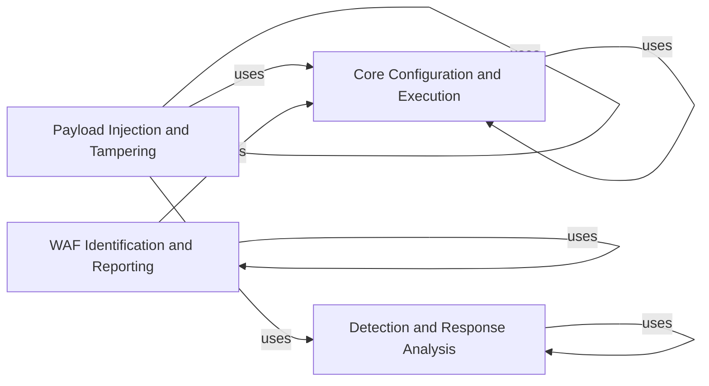

## Component Details

WhatWaf is a tool designed to detect web application firewalls (WAFs). It operates by sending various payloads to a target URL and analyzing the responses to identify the presence and type of WAF. The tool manages configurations, injects payloads, handles responses, utilizes tampering techniques to bypass WAFs, identifies firewalls, formats output, loads scripts, integrates with a miner module, and provides a main execution trigger.

### Core Configuration and Execution
This component manages the application's core settings, including target URLs, request headers, and update mechanisms. It also serves as the main entry point for triggering the WAF detection process, orchestrating the execution of other components and formatting output messages. It acts as a central hub for configuration data and overall control flow.
- **Related Classes/Methods**: `WhatWaf.lib.settings` (full file reference), `WhatWaf.trigger.main:main` (61:564), `WhatWaf.lib.formatter` (full file reference)

### Payload Injection and Tampering
This component focuses on generating, modifying, and injecting payloads into the target URL. It utilizes a library of tampering modules to bypass WAFs and orchestrates the main detection logic. It interacts with the Detection and Response Handling component to send requests and analyze responses.
- **Related Classes/Methods**: `WhatWaf.content` (full file reference), `WhatWaf.content:encode` (220:225), `WhatWaf.content:get_working_tampers` (238:330), `WhatWaf.content:dictify_output` (364:392), `WhatWaf.content:detection_main` (395:729), `WhatWaf.content.tampers` (full file reference)

### Detection and Response Analysis
This component manages the queue of detections, handles threading for efficient response retrieval, and assists in the detection process. It loads scripts defining payloads and techniques and analyzes responses to identify WAFs. It interacts with the Payload Injection and Tampering component to send requests and the WAF Identification and Reporting component to report findings.
- **Related Classes/Methods**: `WhatWaf.content.DetectionQueue` (58:217), `WhatWaf.content.DetectionQueue:get_response` (82:142), `WhatWaf.content.DetectionQueue:threader` (144:149), `WhatWaf.content.DetectionQueue:threaded_get_response_helper` (151:190), `WhatWaf.content.DetectionQueue:threaded_get_response` (192:217), `WhatWaf.content.ScriptQueue:load_scripts` (38:55)

### WAF Identification and Reporting
This component is responsible for identifying firewalls based on the analysis of responses and reporting detected issues. It creates identifiers for firewalls and requests the creation of firewall-related issues. It uses the Core Configuration and Execution component to access settings and the Output and Logging component to format output messages.
- **Related Classes/Methods**: `WhatWaf.lib.firewall_found` (full file reference), `WhatWaf.lib.firewall_found:create_identifier` (18:24), `WhatWaf.lib.firewall_found:request_issue_creation` (101:164), `WhatWaf.lib.firewall_found:request_firewall_issue_creation` (167:235)