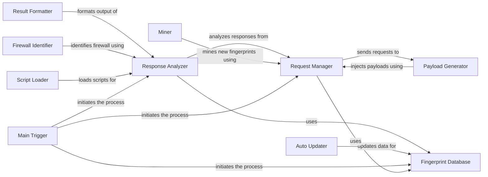

## Component Details

WhatWaf is a tool designed to detect and identify Web Application Firewalls (WAFs). It operates by sending various HTTP requests with malicious payloads to a target URL and analyzing the responses to identify patterns and signatures indicative of specific WAFs. The tool leverages a database of known WAF fingerprints and employs techniques such as signature matching, behavioral analysis, and anomaly detection to accurately determine the presence and type of WAF protecting the target.

### Request Manager
The Request Manager component handles the creation and sending of HTTP requests to the target server. It configures request headers, manages connections, and retrieves web pages. This component is responsible for ensuring that requests are properly formatted and transmitted, and it interacts with the Fingerprint Database to check for cached results and optimize performance.
- **Source Reference**: `"WhatWaf.lib.settings:configure_request_headers"`
  - *File*: `WhatWaf/lib/settings.py`
- **Source Reference**: `"WhatWaf.lib.settings:get_page"`
  - *File*: `WhatWaf/lib/settings.py`
- **Source Reference**: `"WhatWaf.lib.settings:test_target_connection"`
  - *File*: `WhatWaf/lib/settings.py`
- **Source Reference**: `"WhatWaf.lib.settings:check_url_against_cached"`
  - *File*: `WhatWaf/lib/settings.py`

### Payload Generator
The Payload Generator component is responsible for creating and encoding malicious payloads designed to bypass WAF filters and trigger potential vulnerabilities. It utilizes various tampering techniques to generate diverse payloads, ensuring effective testing of the target's security posture. This component works closely with the Request Manager to inject these payloads into HTTP requests.
- **Source Reference**: `"WhatWaf.content:get_working_tampers"`
  - *File*: `WhatWaf/content.py`
- **Source Reference**: `"WhatWaf.content:encode"`
  - *File*: `WhatWaf/content.py`
- **Source Reference**: `"WhatWaf.content.tampers.randomdecoys:tamper"`
  - *File*: `WhatWaf/content/tampers/randomdecoys.py`
- **Source Reference**: `"WhatWaf.content.tampers.randomcomments:tamper"`
  - *File*: `WhatWaf/content/tampers/randomcomments.py`
- **Source Reference**: `"WhatWaf.content.tampers.randomunicode:tamper"`
  - *File*: `WhatWaf/content/tampers/randomunicode.py`

### Response Analyzer
The Response Analyzer component analyzes HTTP responses received from the target server to detect the presence and type of WAF. It employs signature matching, behavioral analysis, and anomaly detection techniques to identify WAFs based on response characteristics. This component is central to the WAF detection process and relies on the Fingerprint Database for accurate identification.
- **Source Reference**: `"WhatWaf.content.DetectionQueue:get_response"`
  - *File*: `WhatWaf/content/DetectionQueue.py`
- **Source Reference**: `"WhatWaf.content:detection_main"`
  - *File*: `WhatWaf/content.py`

### Fingerprint Database
The Fingerprint Database component manages the WAF fingerprint data, storing and retrieving information about known WAFs, including signatures and detection rules. It allows for inserting new payloads and URLs, and checking URLs against cached results. This component is essential for accurate WAF identification and is updated by the Miner component.
- **Source Reference**: `"WhatWaf.lib.database:insert_payload"`
  - *File*: `WhatWaf/lib/database.py`
- **Source Reference**: `"WhatWaf.lib.database:insert_url"`
  - *File*: `WhatWaf/lib/database.py`

### Result Formatter
The Result Formatter component formats the WAF detection results into various output formats, such as text, JSON, and HTML. It presents the findings in a user-friendly manner, ensuring that the results are easily understandable and usable. This component receives the analysis results from the Response Analyzer and prepares them for presentation.
- **Source Reference**: `"WhatWaf.lib.formatter:info"`
  - *File*: `WhatWaf/lib/formatter.py`
- **Source Reference**: `"WhatWaf.lib.formatter:debug"`
  - *File*: `WhatWaf/lib/formatter.py`
- **Source Reference**: `"WhatWaf.lib.formatter:warn"`
  - *File*: `WhatWaf/lib/formatter.py`
- **Source Reference**: `"WhatWaf.lib.formatter:error"`
  - *File*: `WhatWaf/lib/formatter.py`
- **Source Reference**: `"WhatWaf.lib.formatter:fatal"`
  - *File*: `WhatWaf/lib/formatter.py`
- **Source Reference**: `"WhatWaf.lib.formatter:payload"`
  - *File*: `WhatWaf/lib/formatter.py`
- **Source Reference**: `"WhatWaf.lib.formatter:success"`
  - *File*: `WhatWaf/lib/formatter.py`
- **Source Reference**: `"WhatWaf.lib.formatter:discover"`
  - *File*: `WhatWaf/lib/formatter.py`
- **Source Reference**: `"WhatWaf.lib.settings:produce_results"`
  - *File*: `WhatWaf/lib/settings.py`

### Firewall Identifier
The Firewall Identifier component identifies the specific firewall based on the analysis of the responses. It creates identifiers and handles requests related to firewall identification issues. This component is responsible for pinpointing the exact WAF in use, leveraging the analysis performed by the Response Analyzer.
- **Source Reference**: `"WhatWaf.lib.firewall_found:create_identifier"`
  - *File*: `WhatWaf/lib/firewall_found.py`
- **Source Reference**: `"WhatWaf.lib.firewall_found:request_issue_creation"`
  - *File*: `WhatWaf/lib/firewall_found.py`
- **Source Reference**: `"WhatWaf.lib.firewall_found:request_firewall_issue_creation"`
  - *File*: `WhatWaf/lib/firewall_found.py`

### Miner
The Miner component is responsible for mining new WAF fingerprints. It involves installing and running external tools to discover new WAF signatures and detection methods. This component helps to keep the Fingerprint Database up-to-date, ensuring the tool's effectiveness against evolving WAF technologies. It interacts with the Request Manager to send requests during the mining process.
- **Source Reference**: `"WhatWaf.lib.miner.Miner:__do_miner_install"`
  - *File*: `WhatWaf/lib/miner/Miner.py`
- **Source Reference**: `"WhatWaf.lib.miner.Miner:init"`
  - *File*: `WhatWaf/lib/miner/Miner.py`
- **Source Reference**: `"WhatWaf.lib.miner.Miner:main"`
  - *File*: `WhatWaf/lib/miner/Miner.py`
- **Source Reference**: `"WhatWaf.lib.settings:do_mine_for_whatwaf"`
  - *File*: `WhatWaf/lib/settings.py`

### Script Loader
The Script Loader component loads scripts used for detection or other purposes. It manages the loading and execution of scripts that enhance the tool's functionality. This component allows for flexible and extensible detection capabilities, providing custom logic to the Response Analyzer.
- **Source Reference**: `"WhatWaf.content.ScriptQueue:load_scripts"`
  - *File*: `WhatWaf/content/ScriptQueue.py`

### Auto Updater
The Auto Updater component handles automatically updating the tool or its data. It ensures that the tool is always running with the latest fingerprints and detection rules. This component is crucial for maintaining the tool's effectiveness against evolving WAF technologies, updating the Fingerprint Database with the latest information.
- **Source Reference**: `"WhatWaf.lib.settings:auto_update"`
  - *File*: `WhatWaf/lib/settings.py`

### Main Trigger
The Main Trigger component serves as the entry point for the tool's execution. It initializes and orchestrates the other components to perform WAF detection. This component is responsible for starting the entire process, setting up the Request Manager, Response Analyzer, and Fingerprint Database.
- **Source Reference**: `"WhatWaf.trigger.main:main"`
  - *File*: `WhatWaf/trigger/main.py`