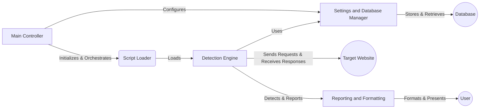

## WhatWaf: High-Level Data Flow Diagram

WhatWaf is a security tool designed to detect web application firewalls (WAFs). It operates by sending various HTTP requests and analyzing the responses to identify the presence and type of WAF protecting a given website.

## Component Descriptions

**Main Controller:** This component is responsible for initializing the program, parsing command-line arguments, and orchestrating the overall WAF detection process. It loads scripts via the `Script Loader` and configures the `Settings and Database Manager` with user-provided options. It then triggers the `Detection Engine` to start the detection process, and finally, the `Reporting and Formatting` component presents the results to the user.

**Script Loader:** The Script Loader is responsible for loading detection scripts that define the specific requests and analysis logic for identifying different WAFs. It provides these scripts to the `Detection Engine`.

**Detection Engine:** This is the core component that sends HTTP requests to the target website and analyzes the responses to detect the presence of a WAF. It uses the scripts loaded by the `Script Loader` and the settings managed by the `Settings and Database Manager`. It reports any detected firewalls to the `Reporting and Formatting` component.

**Settings and Database Manager:** This component manages various settings and configurations, such as user agents, proxies, timeouts, and database interactions. It provides these settings to the `Detection Engine` and stores/retrieves data from the database.

**Reporting and Formatting:** This component formats the output of the tool, including informational messages, warnings, errors, and successful detections. It receives detection results from the `Detection Engine` and presents them to the user in a readable format.