```mermaid
graph LR
    Core_Engine["Core Engine"]
    Configuration_Manager["Configuration Manager"]
    Payload_Manager["Payload Manager"]
    Request_Response_Handler["Request-Response Handler"]
    Firewall_Analyzer["Firewall Analyzer"]
    Output_Handler["Output Handler"]
    Payload_and_URL_Database_Manager["Payload and URL Database Manager"]
    Resource_Miner["Resource Miner"]
    Core_Engine -- "Initializes and orchestrates" --> Configuration_Manager
    Core_Engine -- "Initializes and orchestrates" --> Payload_Manager
    Core_Engine -- "Initializes and orchestrates" --> Request_Response_Handler
    Core_Engine -- "Initializes and orchestrates" --> Firewall_Analyzer
    Core_Engine -- "Initializes and orchestrates" --> Output_Handler
    Configuration_Manager -- "Provides configuration to" --> Payload_Manager
    Configuration_Manager -- "Provides configuration to" --> Request_Response_Handler
    Configuration_Manager -- "Provides configuration to" --> Firewall_Analyzer
    Configuration_Manager -- "Provides configuration to" --> Resource_Miner
    Payload_Manager -- "Generates and tampers payloads for" --> Request_Response_Handler
    Request_Response_Handler -- "Sends requests and receives responses for" --> Firewall_Analyzer
    Output_Handler -- "Formats output for" --> Core_Engine
    Output_Handler -- "Formats output for" --> Firewall_Analyzer
    Output_Handler -- "Formats output for" --> Resource_Miner
    Payload_and_URL_Database_Manager -- "Persists and retrieves data for" --> Payload_Manager
    Resource_Miner -- "Utilizes for resource-intensive tasks" --> Core_Engine
    click Core_Engine href "https://github.com/CodeBoarding/GeneratedOnBoardings/blob/main/WhatWaf/Core Engine.md" "Details"
    click Configuration_Manager href "https://github.com/CodeBoarding/GeneratedOnBoardings/blob/main/WhatWaf/Configuration Manager.md" "Details"
    click Payload_Manager href "https://github.com/CodeBoarding/GeneratedOnBoardings/blob/main/WhatWaf/Payload Manager.md" "Details"
    click Request_Response_Handler href "https://github.com/CodeBoarding/GeneratedOnBoardings/blob/main/WhatWaf/Request-Response Handler.md" "Details"
    click Firewall_Analyzer href "https://github.com/CodeBoarding/GeneratedOnBoardings/blob/main/WhatWaf/Firewall Analyzer.md" "Details"
    click Output_Handler href "https://github.com/CodeBoarding/GeneratedOnBoardings/blob/main/WhatWaf/Output Handler.md" "Details"
    click Payload_and_URL_Database_Manager href "https://github.com/CodeBoarding/GeneratedOnBoardings/blob/main/WhatWaf/Payload and URL Database Manager.md" "Details"
    click Resource_Miner href "https://github.com/CodeBoarding/GeneratedOnBoardings/blob/main/WhatWaf/Resource Miner.md" "Details"
```

## Component Details

WhatWaf is a web application firewall (WAF) detection tool. Its primary function is to identify the presence and type of WAFs protecting a given website. It achieves this by sending a series of crafted HTTP requests, analyzing the responses, and applying various detection techniques. The tool leverages a database of known WAF signatures and employs payload tampering methods to bypass potential firewall rules. The core flow involves configuring the target URL and scan settings, generating and encoding payloads, sending requests, analyzing responses for firewall signatures, and reporting the findings.

### Core Engine
The Core Engine orchestrates the entire WAF detection process. It initializes settings, manages the request/response cycle, and coordinates with other components like the Payload Manager, Firewall Analyzer, and Output Handler. It's the central processing unit that drives the application's functionality.
- **Related Classes/Methods**: `WhatWaf.trigger.main` (61:564), `WhatWaf.content` (1:1000)

### Configuration Manager
The Configuration Manager handles all aspects of application configuration, including loading settings from files or command-line arguments, managing request headers, handling target URLs, caching configurations, and managing updates. It provides a centralized point of access for all configuration parameters used throughout the application.
- **Related Classes/Methods**: `WhatWaf.lib.settings` (1:1000), `WhatWaf.lib.cmd` (1:1000)

### Payload Manager
The Payload Manager is responsible for generating, encoding, and tampering with payloads used to probe for WAFs. It integrates with the Script Queue to load and manage scripts for dynamic payload generation and utilizes various tampering techniques to bypass firewall rules. It also interacts with the Payload and URL Database Manager to persist and reuse payloads.
- **Related Classes/Methods**: `WhatWaf.content.tampers` (1:1000), `WhatWaf.content.ScriptQueue` (23:55)

### Request-Response Handler
The Request/Response Handler manages the sending of HTTP requests and the processing of responses. It handles threading for concurrent requests, manages the detection queue, and passes responses to the Firewall Analyzer for detection. It ensures efficient and reliable communication with the target web server.
- **Related Classes/Methods**: `WhatWaf.content.DetectionQueue` (58:217)

### Firewall Analyzer
The Firewall Analyzer is responsible for analyzing HTTP responses to detect the presence and type of WAFs. It uses a database of known WAF signatures and applies various detection techniques to identify firewalls based on response patterns. It also generates issue reports when a firewall is detected.
- **Related Classes/Methods**: `WhatWaf.lib.firewall_found` (1:1000)

### Output Handler
The Output Handler is responsible for formatting and presenting the results of the WAF detection process. It handles different output formats (e.g., console, file) and provides a consistent and user-friendly way to view the findings. It formats messages, including info, debug, warnings, errors, payloads, success messages, and discoveries.
- **Related Classes/Methods**: `WhatWaf.lib.formatter` (1:1000)

### Payload and URL Database Manager
The Payload and URL Database Manager handles interactions with the database, specifically inserting payloads and URLs. It provides persistence for payloads and target URLs, allowing the application to track and reuse them across multiple scans. This component ensures data is stored and retrieved efficiently.
- **Related Classes/Methods**: `WhatWaf.lib.database` (1:1000)

### Resource Miner
The Resource Miner component integrates with external miners for resource-intensive tasks. It handles miner installation and execution, offloading computationally expensive tasks from the main application thread. This allows the application to perform complex operations without impacting performance.
- **Related Classes/Methods**: `WhatWaf.lib.miner.Miner` (28:147)