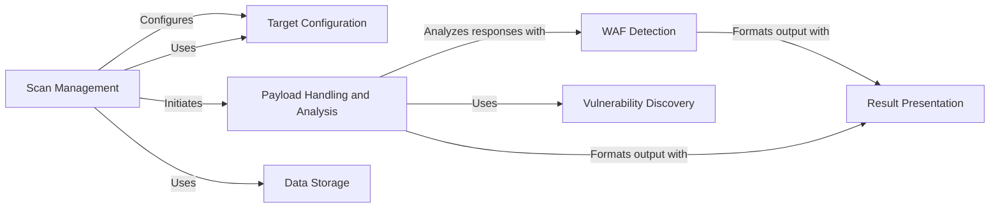

## Component Details

WhatWaf is a security tool designed to identify and analyze web application firewalls (WAFs). It operates by sending a variety of malicious payloads to a target URL and analyzing the responses to detect the presence and characteristics of a WAF. The tool configures target settings, orchestrates the scanning process, executes payloads, analyzes responses, integrates with vulnerability miners, reports results, and persists data.

### Target Configuration
This component manages the configuration of the target URL, request headers, and other settings required for the scan. It ensures that the tool is properly configured to interact with the target and handles tasks such as version checking and connection testing.
- **Related Classes/Methods**: `WhatWaf.lib.settings:get_page`, `WhatWaf.lib.settings:configure_request_headers`, `WhatWaf.lib.settings:auto_assign`, `WhatWaf.lib.settings:check_version`, `WhatWaf.lib.settings:test_target_connection`

### Scan Management
This component orchestrates the entire scanning process. It initializes the scan, coordinates the activities of other components like payload execution and vulnerability mining, and ensures that the scan progresses smoothly from start to finish.
- **Related Classes/Methods**: `WhatWaf.trigger.main:main`

### Payload Handling and Analysis
This component is responsible for generating and sending malicious payloads to the target, receiving and analyzing the responses, and detecting potential vulnerabilities. It manages concurrent requests using a threader and extracts relevant information from the responses for further analysis.
- **Related Classes/Methods**: `WhatWaf.content.DetectionQueue:get_response`, `WhatWaf.content.DetectionQueue:threader`, `WhatWaf.content:detection_main`

### WAF Detection
This component focuses on identifying and reporting detected web application firewalls (WAFs). It analyzes the responses received from the target to determine the presence and type of WAF, and then generates appropriate identifiers and reports.
- **Related Classes/Methods**: `WhatWaf.lib.firewall_found:create_identifier`, `WhatWaf.lib.firewall_found:request_issue_creation`

### Vulnerability Discovery
This component integrates with external vulnerability miners to discover potential weaknesses in the target application. It leverages the capabilities of these miners to identify vulnerabilities that might be missed by other detection methods.
- **Related Classes/Methods**: `WhatWaf.lib.miner.Miner:main`

### Result Presentation
This component handles the formatting and presentation of scan results. It provides a user-friendly interface for displaying information, warnings, errors, and debug messages, making it easy for users to understand the findings of the scan.
- **Related Classes/Methods**: `WhatWaf.lib.formatter:info`, `WhatWaf.lib.formatter:debug`, `WhatWaf.lib.formatter:warn`, `WhatWaf.lib.formatter:error`, `WhatWaf.lib.settings:produce_results`

### Data Storage
This component is responsible for storing and retrieving data related to payloads and URLs. It provides a persistent storage mechanism for scan data, allowing the tool to track its progress and maintain a history of previous scans.
- **Related Classes/Methods**: `WhatWaf.lib.database:insert_payload`, `WhatWaf.lib.database:insert_url`