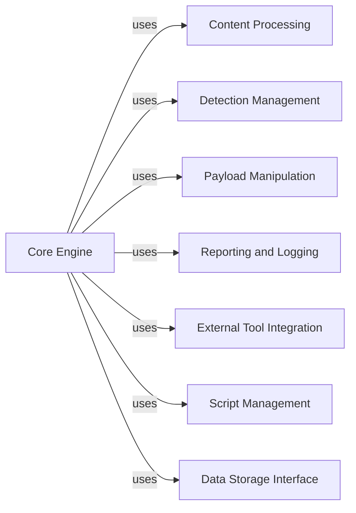

## Component Details

WhatWaf is a tool designed to identify Web Application Firewalls (WAFs). It operates by sending various HTTP requests and analyzing the responses to detect patterns indicative of different WAFs. The tool manages settings, crafts requests, processes responses, and reports findings. It also integrates with external miners to extend its capabilities and uses tamper scripts to evade WAF detection mechanisms.

### Core Engine
The Core Engine is the heart of WhatWaf, orchestrating the entire WAF detection process. It manages settings, configures requests, sends them to the target, and analyzes the responses to identify potential WAFs. This component also handles the overall flow of the application, including initialization, target testing, and result production.
- **Related Classes/Methods**: ``WhatWaf.lib.settings:get_page` (141:174)`, ``WhatWaf.lib.settings:configure_request_headers` (176:200)`, ``WhatWaf.lib.settings:produce_results` (409:429)`, ``WhatWaf.lib.settings:test_target_connection` (129:139)`, ``WhatWaf.content:detection_main` (54:63)`

### Content Processing
The Content Processing component is responsible for encoding request content, retrieving tamper scripts, and converting output into a structured dictionary format. It prepares the data for transmission and ensures that the responses are easily processed and analyzed.
- **Related Classes/Methods**: ``WhatWaf.content:encode` (24:32)`, ``WhatWaf.content:get_working_tampers` (34:42)`, ``WhatWaf.content:dictify_output` (44:52)`

### Detection Management
The Detection Management component handles the execution of detection tasks, including retrieving responses, managing threads, and providing helper functions for threaded requests. It ensures that the detection process is efficient and can handle multiple requests concurrently.
- **Related Classes/Methods**: ``WhatWaf.content.DetectionQueue:get_response` (21:30)`, ``WhatWaf.content.DetectionQueue:threader` (32:41)`, ``WhatWaf.content.DetectionQueue:threaded_get_response_helper` (43:52)`, ``WhatWaf.content.DetectionQueue:threaded_get_response` (54:63)`

### Payload Manipulation
The Payload Manipulation component provides tamper scripts that modify payloads to evade WAF detection. These scripts include techniques such as adding random decoys, comments, and unicode characters to the payloads.
- **Related Classes/Methods**: ``WhatWaf.content.tampers.randomdecoys:tamper` (3:6)`, ``WhatWaf.content.tampers.randomcomments:tamper` (3:6)`, ``WhatWaf.content.tampers.randomunicode:tamper` (3:6)`

### Reporting and Logging
The Reporting and Logging component handles the formatting and output of messages, including information, debug, warning, and error messages. It ensures that all messages are displayed in a consistent and informative manner. It also manages the reporting of identified firewalls.
- **Related Classes/Methods**: ``WhatWaf.lib.formatter:info` (13:16)`, ``WhatWaf.lib.formatter:debug` (18:21)`, ``WhatWaf.lib.formatter:warn` (23:26)`, ``WhatWaf.lib.formatter:error` (28:31)`, ``WhatWaf.lib.firewall_found:request_firewall_issue_creation` (34:42)`

### External Tool Integration
This component manages the integration with external tools, specifically miners. It handles the installation and execution of these tools, allowing WhatWaf to extend its functionality by leveraging external resources.
- **Related Classes/Methods**: ``WhatWaf.lib.miner.Miner:__do_miner_install` (41:50)`, ``WhatWaf.lib.miner.Miner:init` (24:39)`, ``WhatWaf.lib.miner.Miner:main` (52:55)`

### Script Management
This component is responsible for loading and managing scripts used in the detection process. It loads the scripts and makes them available for execution during the WAF detection process.
- **Related Classes/Methods**: ``WhatWaf.content.ScriptQueue:load_scripts` (15:24)`

### Data Storage Interface
This component provides an interface for interacting with the database. It includes functions for inserting payloads and URLs, allowing WhatWaf to store data related to the scanning process.
- **Related Classes/Methods**: ``WhatWaf.lib.database:insert_payload` (20:28)`, ``WhatWaf.lib.database:insert_url` (30:38)`