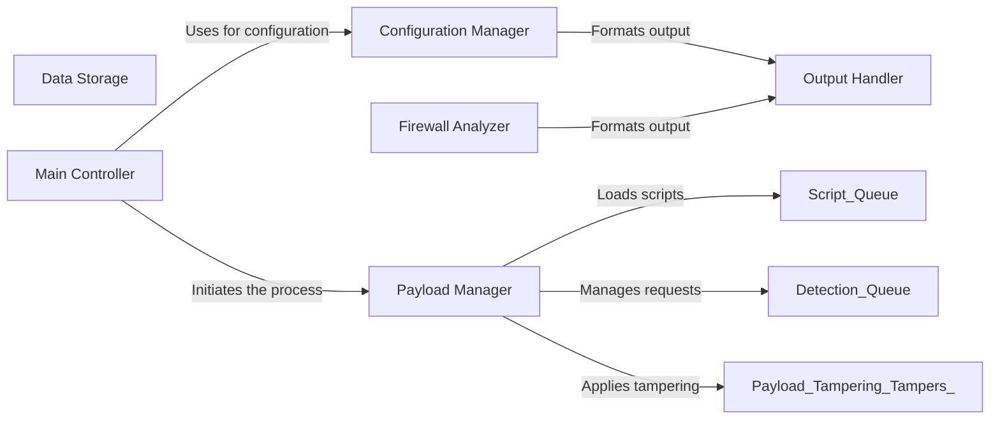

## Component Details

WhatWaf is a web application firewall (WAF) detection tool. It identifies the presence of WAFs by sending malicious payloads and analyzing the responses. The tool manages configurations, crafts payloads using various encoding and tampering techniques, interacts with a database for storing payloads and URLs, analyzes responses to detect firewalls, and formats output for user consumption. The main flow involves configuring the tool, generating and sending payloads, analyzing responses, and reporting findings.

### Configuration Manager
The Configuration Manager handles the application's settings and configurations. It loads settings, manages request headers, handles target URLs, and manages updates. It provides a centralized point for accessing and managing the application's configuration.
- **Related Classes/Methods**: `WhatWaf.lib.settings` (None:None), `WhatWaf.lib.cmd` (None:None)

### Data Storage
The Data Storage component manages interactions with the database. It's responsible for inserting payloads and URLs into the database, providing a persistent storage mechanism for the application's data.
- **Related Classes/Methods**: `WhatWaf.lib.database` (None:None)

### Firewall Analyzer
The Firewall Analyzer component is responsible for detecting firewalls and reporting detected issues. It analyzes HTTP responses to identify the presence of a firewall and generates reports based on the findings.
- **Related Classes/Methods**: `WhatWaf.lib.firewall_found` (None:None)

### Output Handler
The Output Handler component formats output messages for various events, including info, debug, warnings, errors, payloads, success messages, and discoveries. It provides a consistent and user-friendly way to present information to the user.
- **Related Classes/Methods**: `WhatWaf.lib.formatter` (None:None)

### Payload Manager
The Payload Manager component handles the generation, encoding, and tampering of payloads. It loads scripts for payload generation, manages a queue of detections, and applies various tampering techniques to bypass firewalls. It is the core component for crafting and manipulating payloads for WAF detection.
- **Related Classes/Methods**: `WhatWaf.content` (None:None), `WhatWaf.content.ScriptQueue` (23:55), `WhatWaf.content.DetectionQueue` (58:217), `WhatWaf.content.tampers` (None:None)

### Main Controller
The Main Controller component serves as the entry point for the WhatWaf application. It initializes the Configuration Manager and Payload Manager, orchestrating the overall WAF detection process.
- **Related Classes/Methods**: `WhatWaf.trigger.main` (61:564)