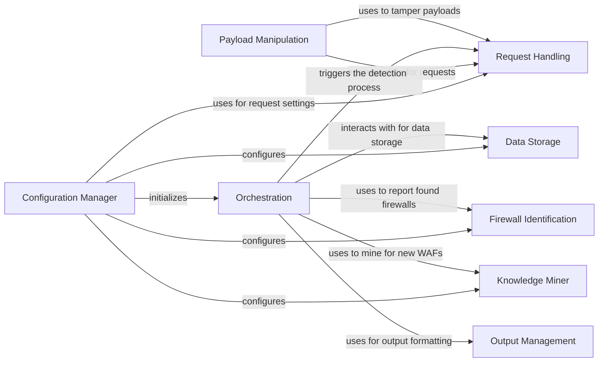

## Component Details

The WhatWaf tool is designed to identify Web Application Firewalls (WAFs) protecting a given website. It operates by sending a series of HTTP requests with specially crafted payloads to the target, analyzing the responses, and comparing them against known WAF signatures. The tool manages settings, encodes payloads, sends requests, processes responses, and reports detected firewalls, while also providing mechanisms for updating its detection capabilities.

### Configuration Manager
The Configuration Manager component is responsible for handling all configuration aspects of the WhatWaf tool. This includes managing target URLs, request headers, user agents, timeouts, and other parameters necessary for conducting WAF detection. It also handles tasks such as version checking and auto-updating, ensuring the tool is always up-to-date with the latest detection capabilities.
- **Related Classes/Methods**: `WhatWaf.lib.settings`

### Data Storage
The Data Storage component manages the storage and retrieval of data related to WAF detection. This includes payloads, URLs, and scan results. It provides functions for inserting new payloads and URLs into the database, enabling persistent storage of scan data and facilitating future analysis.
- **Related Classes/Methods**: `WhatWaf.lib.database`

### Firewall Identification
The Firewall Identification component is responsible for creating unique identifiers for detected firewalls and managing issues related to firewall detection. It handles the creation of firewall issues and requests for issue creation, providing a structured way to report and track detected firewalls.
- **Related Classes/Methods**: `WhatWaf.lib.firewall_found`

### Output Management
The Output Management component provides a consistent way to format and display information, debug messages, warnings, errors, and successful detections to the user. It offers different formatting options for various types of output, ensuring a clear and informative user experience.
- **Related Classes/Methods**: `WhatWaf.lib.formatter`

### Knowledge Miner
The Knowledge Miner component integrates with a "miner" module, likely used for discovering new WAF fingerprints or detection techniques. It handles the installation and execution of the miner, allowing the tool to dynamically update its detection capabilities and stay ahead of evolving WAF technologies.
- **Related Classes/Methods**: `WhatWaf.lib.miner.Miner`

### Request Handling
The Request Handling component is responsible for managing the queue of detection requests, sending HTTP requests to the target, and processing the responses. It handles threading and asynchronous request processing to improve performance, ensuring efficient and scalable WAF detection.
- **Related Classes/Methods**: `WhatWaf.content.DetectionQueue`

### Payload Manipulation
The Payload Manipulation component handles the encoding of payloads and data before sending them to the target. It provides functions for encoding data in various formats and applies tampering techniques to bypass WAF filters, enhancing the tool's ability to detect WAFs even when they are actively trying to block malicious requests.
- **Related Classes/Methods**: `WhatWaf.content`, `WhatWaf.content.tampers`

### Orchestration
The Orchestration component serves as the entry point for the WhatWaf tool. It initializes the necessary components and starts the WAF detection process. It orchestrates the interaction between the other components to perform the WAF detection and analysis, coordinating the entire workflow from start to finish.
- **Related Classes/Methods**: `WhatWaf.trigger.main`