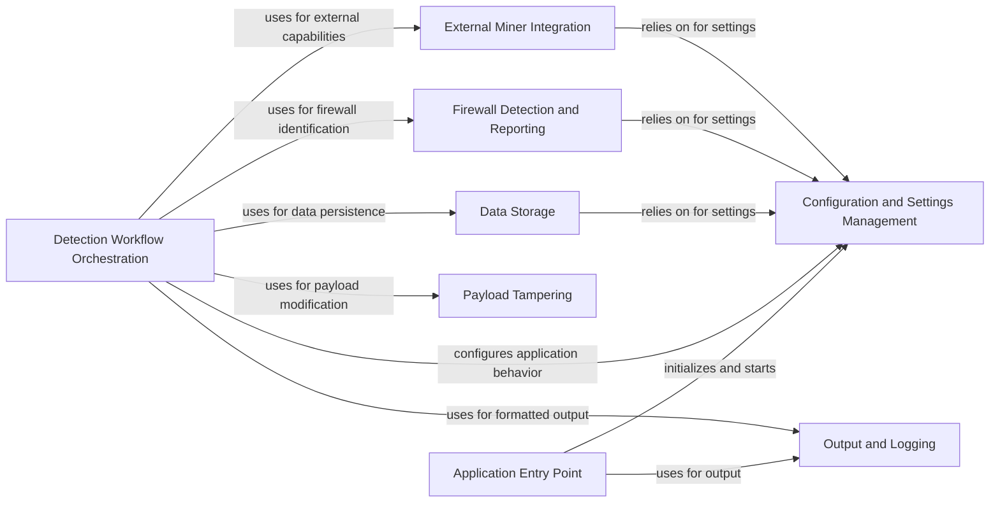

## Component Details

WhatWaf is a tool designed to detect web application firewalls (WAFs). It operates by sending various payloads to a target URL and analyzing the responses to identify patterns indicative of a WAF. The tool manages settings, interacts with a database, formats output, integrates with a miner module, and orchestrates a detection workflow involving script loading, queue management, content processing, and payload tampering. The main goal is to accurately identify the presence and type of WAF protecting a web application.

### Configuration and Settings Management
This component is responsible for managing the application's configuration and settings. It handles loading settings, managing request headers, handling target URLs, caching, and managing updates. It acts as a central repository for configuration data and provides methods for accessing and modifying these settings, ensuring consistent behavior across the application.
- **Related Classes/Methods**: `WhatWaf.lib.settings` (full file reference), `WhatWaf.lib.settings:get_page` (354:408), `WhatWaf.lib.settings:configure_request_headers` (426:473), `WhatWaf.lib.settings:produce_results` (476:497), `WhatWaf.lib.settings:generate_random_post_string` (516:535), `WhatWaf.lib.settings:auto_assign` (538:557), `WhatWaf.lib.settings:create_fingerprint` (560:592), `WhatWaf.lib.settings:write_to_file` (595:658), `WhatWaf.lib.settings:check_version` (696:719), `WhatWaf.lib.settings:test_target_connection` (739:758), `WhatWaf.lib.settings:save_temp_issue` (790:799), `WhatWaf.lib.settings:export_payloads` (802:847), `WhatWaf.lib.settings:check_url_against_cached` (850:873), `WhatWaf.lib.settings:display_cached` (876:903), `WhatWaf.lib.settings:make_saying_pretty` (928:955), `WhatWaf.lib.settings:do_mine_for_whatwaf` (965:970), `WhatWaf.lib.settings:auto_update` (973:993)

### Data Storage
This component manages the storage and retrieval of data, specifically payloads and URLs, using a database. It provides an abstraction layer for database operations, ensuring data integrity and consistency. This component allows other components to store and retrieve information related to the WAF detection process.
- **Related Classes/Methods**: `WhatWaf.lib.database:insert_payload` (54:72), `WhatWaf.lib.database:insert_url` (75:124)

### Firewall Detection and Reporting
This component is responsible for identifying firewalls and reporting detected issues. It analyzes responses to determine the presence of a WAF, creates identifiers for firewalls, and requests the creation of firewall-related issues. It plays a crucial role in determining whether a WAF is present and reporting the findings.
- **Related Classes/Methods**: `WhatWaf.lib.firewall_found` (full file reference), `WhatWaf.lib.firewall_found:create_identifier` (18:24), `WhatWaf.lib.firewall_found:request_issue_creation` (101:164), `WhatWaf.lib.firewall_found:request_firewall_issue_creation` (167:235)

### Output and Logging
This component provides a consistent way to format output messages, including informational messages, debug messages, warnings, errors, and payload details. It ensures that all output is presented in a uniform and readable format, facilitating debugging and analysis. It also handles logging of important events and errors, providing a record of the application's activities.
- **Related Classes/Methods**: `WhatWaf.lib.formatter` (full file reference), `WhatWaf.lib.formatter:info` (29:32), `WhatWaf.lib.formatter:debug` (35:38), `WhatWaf.lib.formatter:warn` (41:49), `WhatWaf.lib.formatter:error` (52:55), `WhatWaf.lib.formatter:fatal` (58:61), `WhatWaf.lib.formatter:payload` (64:67), `WhatWaf.lib.formatter:success` (70:73), `WhatWaf.lib.formatter:discover` (87:90)

### External Miner Integration
This component handles the integration with the miner module, including installation and execution. It allows the application to leverage external mining tools for enhanced detection capabilities. It manages the installation, configuration, and execution of the miner module, extending the application's detection capabilities.
- **Related Classes/Methods**: `WhatWaf.lib.miner.Miner` (28:147), `WhatWaf.lib.miner.Miner:__do_miner_install` (55:78), `WhatWaf.lib.miner.Miner:init` (80:95), `WhatWaf.lib.miner.Miner:main` (111:147)

### Detection Workflow Orchestration
This component orchestrates the main detection workflow. It loads scripts, manages the detection queue, retrieves responses, processes content, and utilizes tampering modules. It is the central control point for the WAF detection process, coordinating the activities of other components to achieve accurate and efficient results. It manages the overall flow of the detection process.
- **Related Classes/Methods**: `WhatWaf.content` (full file reference), `WhatWaf.content:encode` (220:225), `WhatWaf.content:get_working_tampers` (238:330), `WhatWaf.content:dictify_output` (364:392), `WhatWaf.content:detection_main` (395:729), `WhatWaf.content.ScriptQueue:load_scripts` (38:55), `WhatWaf.content.DetectionQueue` (58:217), `WhatWaf.content.DetectionQueue:get_response` (82:142), `WhatWaf.content.DetectionQueue:threader` (144:149), `WhatWaf.content.DetectionQueue:threaded_get_response_helper` (151:190), `WhatWaf.content.DetectionQueue:threaded_get_response` (192:217)

### Payload Tampering
This component contains various tampering modules used to modify payloads for detection purposes. It provides a collection of techniques for bypassing WAFs by altering the structure and content of payloads. It includes modules for randomizing decoys, adding random comments, and using random unicode characters, enhancing the tool's ability to evade WAF defenses.
- **Related Classes/Methods**: `WhatWaf.content.tampers` (full file reference), `WhatWaf.content.tampers.randomdecoys:tamper` (9:39), `WhatWaf.content.tampers.randomcomments:tamper` (9:21), `WhatWaf.content.tampers.randomunicode:tamper` (8:27)

### Application Entry Point
This is the main entry point for triggering the WhatWaf application. It initializes the application, configures settings, and starts the detection process. It serves as the starting point for the entire WAF detection workflow, orchestrating the initialization and execution of the tool.
- **Related Classes/Methods**: `WhatWaf.trigger.main:main` (61:564)