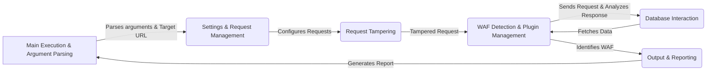

## WhatWaf: High-Level Data Flow Diagram

WhatWaf is a security tool designed to detect Web Application Firewalls (WAFs) by sending various HTTP requests and analyzing the responses. It uses a combination of techniques, including fingerprinting, payload injection, and request tampering, to identify the presence and type of WAF protecting a target web application.

### Component Descriptions:

1.  **Main Execution & Argument Parsing:** This component serves as the entry point of the application. It parses command-line arguments provided by the user, such as the target URL, and initializes the overall WAF detection process. It then passes the parsed information to the `Settings & Request Management` component to configure the requests.

2.  **Settings & Request Management:** This component is responsible for managing the application's configuration settings. It configures request headers, manages proxy settings, and tests the connection to the target URL. It receives the target URL from the `Main Execution & Argument Parsing` component and prepares the requests for the `Request Tampering` component.

3.  **Request Tampering:** This component modifies the outgoing HTTP requests to bypass WAFs. It applies various encoding and tampering techniques to the requests before they are sent to the `WAF Detection & Plugin Management` component. It receives the configured requests from the `Settings & Request Management` component and sends the tampered requests to the `WAF Detection & Plugin Management` component.

4.  **WAF Detection & Plugin Management:** This component contains the core WAF detection logic. It loads and manages detection scripts (plugins) and sends HTTP requests to the target, analyzing the responses to identify potential WAFs. It interacts with the `Database Interaction` component to fetch cached data and stores the results in the `Output & Reporting` component. It receives tampered requests from the `Request Tampering` component and sends requests to the target, then sends the identified WAF to the `Output & Reporting` component.

5.  **Database Interaction:** This component manages the interaction with the database. It initializes the database, fetches cached data (payloads and URLs), and inserts new data into the database. It provides data to the `WAF Detection & Plugin Management` component and receives data from it.

6.  **Output & Reporting:** This component formats and displays the results of the WAF detection process. It generates issue reports for identified firewalls and handles different log levels (info, warn, error, etc.). It receives the identified WAF from the `WAF Detection & Plugin Management` component and generates a report that is displayed to the user, and then returns to the `Main Execution & Argument Parsing` component.