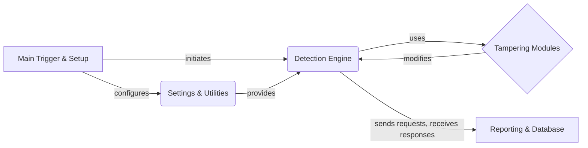

## WhatWaf: High-Level Data Flow Overview

WhatWaf is a security tool designed to detect web application firewalls (WAFs). It operates by sending various HTTP requests and analyzing the responses to identify patterns and signatures indicative of specific WAFs. The tool automates the process of fingerprinting WAFs, providing valuable information for security assessments and penetration testing.

### Component Descriptions:

**A: Main Trigger & Setup:** This component serves as the entry point of the application. It parses command-line arguments, configures the environment, and initiates the core detection process. It sets up the necessary configurations and prepares the system for WAF detection. It configures the Settings & Utilities component and initiates the Detection Engine.

**B: Settings & Utilities:** This component provides utility functions for managing settings, generating random strings, handling requests, and interacting with the database. It also includes functions for checking versions and updating the application. It provides configurations and utilities to the Detection Engine.

**C: Detection Engine:** This is the core component responsible for loading detection scripts, sending requests, analyzing responses, and managing the detection queue. It orchestrates the process of identifying firewalls. It uses the Tampering Modules to modify requests and sends requests to the target, receiving responses for analysis. It then sends the results to the Reporting & Database component.

**D: Tampering Modules:** These modules modify requests to bypass WAFs. They provide various techniques to evade detection. The Detection Engine uses these modules to alter requests before sending them to the target.

**E: Reporting & Database:** This component handles the creation and reporting of firewall detection issues, including generating identifiers and managing sensitive information. It also manages database operations such as inserting payloads and URLs, and fetching data. It receives the results from the Detection Engine and stores/reports the findings.