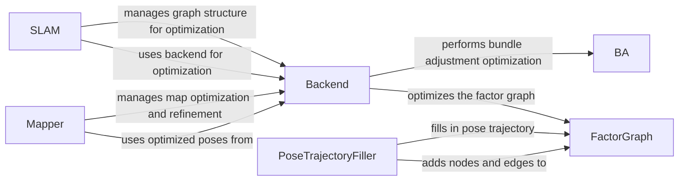

## Component Details

The Backend Optimization component refines the camera poses and map using factor graph optimization. It constructs a factor graph from visual odometry and loop closure constraints, and then optimizes the graph to minimize the error. It uses pose trajectory management to fill in poses for non-keyframes. This component improves the accuracy and consistency of the SLAM results. The main flow involves constructing a factor graph, adding constraints, and performing bundle adjustment to optimize the graph. The purpose is to improve the accuracy and consistency of the SLAM results.

### FactorGraph
The FactorGraph class manages the factor graph representation of the SLAM problem. It's responsible for adding factors (constraints) and keyframes (poses) to the graph, filtering edges, and updating the low-memory representation of the graph. It provides an interface for adding nodes and edges, representing poses and constraints respectively. It interacts with the Backend to perform optimization and PoseTrajectoryFiller to incorporate pose estimates.
- **Related Classes/Methods**: `src.factor_graph.FactorGraph`

### Backend
The Backend class is responsible for performing the optimization of the factor graph. It provides methods for dense bundle adjustment (dense_ba) and loop closure bundle adjustment (loop_ba). It interacts with the FactorGraph to obtain the graph structure and with the BA (Bundle Adjustment) module to perform the optimization. It orchestrates the optimization process, leveraging the BA module for numerical computation.
- **Related Classes/Methods**: `src.backend.Backend`

### BA
The BA (Bundle Adjustment) module implements the core optimization algorithms. It includes standard BA, BA with scale and shift estimation, and possibly more advanced variants (MoBA). It's used by the Backend to refine the pose and map estimates. It provides the numerical routines to minimize the error function defined by the factor graph.
- **Related Classes/Methods**: `src.geom.ba`

### PoseTrajectoryFiller
The PoseTrajectoryFiller class is responsible for filling in the pose trajectory. It sets up the feature extractor and fills the trajectory by interpolating between keyframes. It interacts with the FactorGraph to add interpolated poses and constraints, ensuring a smooth and complete trajectory.
- **Related Classes/Methods**: `src.trajectory_filler.PoseTrajectoryFiller`

### Mapper
The Mapper class manages the overall mapping process. It performs online map optimization (map_opt_online) and final map refinement (final_refine). It interacts with the Backend to optimize the map and with other modules to obtain sensor data and pose estimates. It uses the optimized poses from the Backend to build and refine the map.
- **Related Classes/Methods**: `src.mapper.Mapper`

### SLAM
The SLAM class represents the overall SLAM system. It contains a backend component that is responsible for performing the optimization of the factor graph. It orchestrates the entire SLAM process, including the Backend optimization.
- **Related Classes/Methods**: `src.slam.SLAM`
