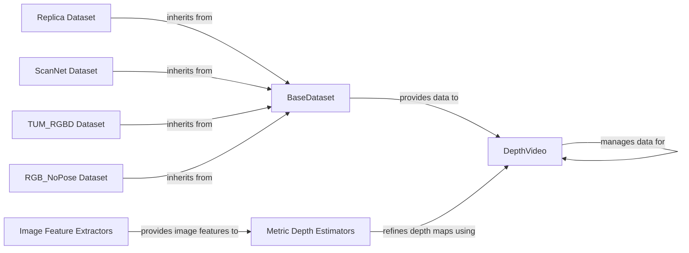

## Component Details

The Data Acquisition and Preprocessing component is responsible for acquiring raw data from various sources, such as depth and RGB cameras, and transforming it into a usable format for downstream tasks like pose estimation and mapping. This involves loading data from different dataset formats, applying monocular depth priors to enhance depth information, and performing essential preprocessing steps like depth upsampling, normalization, reprojection, and filtering. The component ensures that the data is clean, consistent, and suitable for accurate 3D scene understanding.

### DepthVideo
The DepthVideo class manages depth video data, including operations like upsampling, normalization, reprojection, filtering, bundle adjustment (BA), and depth scaling. It also handles uncertainty masks and saving the video. It interacts with dataset loaders to receive depth data and with monocular depth estimators to refine depth information.
- **Related Classes/Methods**: `src.depth_video.DepthVideo`

### BaseDataset
The BaseDataset class serves as an abstract base class for various datasets. It provides a common interface for loading and accessing data, including depth information. Concrete dataset classes inherit from this class and implement dataset-specific loading logic. It interacts with DepthVideo to provide the initial depth data.
- **Related Classes/Methods**: `src.utils.datasets.BaseDataset`

### Replica Dataset
The Replica dataset loader inherits from BaseDataset and implements the loading logic for the Replica dataset.
- **Related Classes/Methods**: `src.utils.datasets.Replica`

### ScanNet Dataset
The ScanNet dataset loader inherits from BaseDataset and implements the loading logic for the ScanNet dataset.
- **Related Classes/Methods**: `src.utils.datasets.ScanNet`

### TUM_RGBD Dataset
The TUM_RGBD dataset loader inherits from BaseDataset and implements the loading logic for the TUM_RGBD dataset, including loading TUM-specific data formats.
- **Related Classes/Methods**: `src.utils.datasets.TUM_RGBD`

### RGB_NoPose Dataset
The RGB_NoPose dataset loader inherits from BaseDataset and implements the loading logic for datasets without pose information.
- **Related Classes/Methods**: `src.utils.datasets.RGB_NoPose`

### Metric Depth Estimators
This module provides functions for obtaining and using metric depth estimators, including creating a DPT2 model and predicting metric depth from images. It interacts with DepthVideo to refine depth maps and with image feature extractors to obtain image features.
- **Related Classes/Methods**: `src.utils.mono_priors.metric_depth_estimators`

### Image Feature Extractors
This module provides functions for obtaining and using image feature extractors, including predicting image features from images. It interacts with Metric Depth Estimators to provide image features for depth estimation.
- **Related Classes/Methods**: `src.utils.mono_priors.img_feature_extractors`
