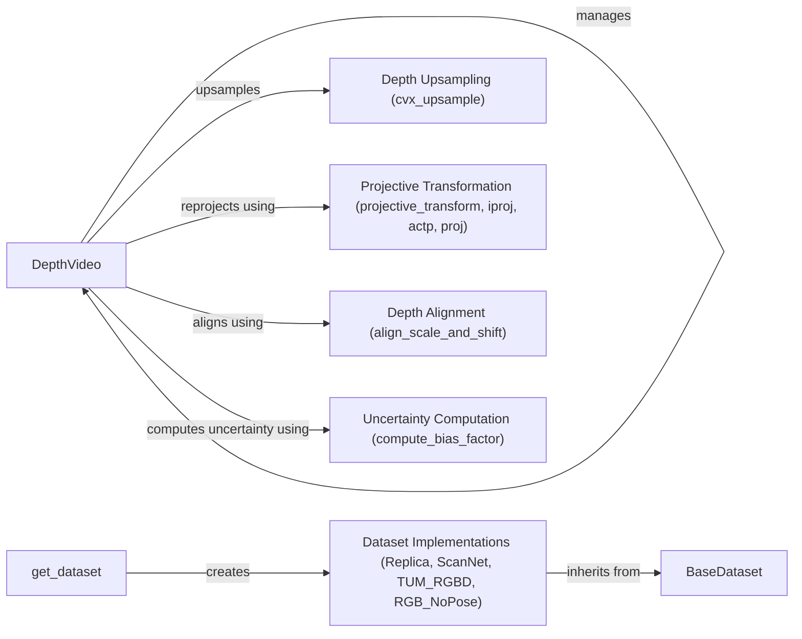

## Component Details

### DepthVideo
The DepthVideo class manages the depth video stream. It stores the depth images and poses, and provides methods for accessing and manipulating them. It also handles the reprojection of depth images into 3D point clouds, and provides filtering and alignment functionalities.
- **Related Classes/Methods**: `src.depth_video.DepthVideo`

### BaseDataset
The BaseDataset class serves as an abstract base class for various dataset implementations. It defines the common interface for loading and accessing data like images, depth maps, and poses, ensuring consistency across different dataset formats.
- **Related Classes/Methods**: `src.utils.datasets.BaseDataset`

### Dataset Implementations (Replica, ScanNet, TUM_RGBD, RGB_NoPose)
These classes (Replica, ScanNet, TUM_RGBD, RGB_NoPose) are concrete implementations of the BaseDataset abstract class, each tailored to load and process data from specific datasets (Replica, ScanNet, TUM RGB-D, and RGB images without pose information, respectively). They inherit the common interface from BaseDataset and implement the dataset-specific loading and parsing logic.
- **Related Classes/Methods**: `src.utils.datasets.Replica`, `src.utils.datasets.ScanNet`, `src.utils.datasets.TUM_RGBD`, `src.utils.datasets.RGB_NoPose`

### get_dataset
The `get_dataset` function acts as a factory function, responsible for creating and returning the appropriate dataset object based on the provided dataset name and root directory. It encapsulates the dataset instantiation logic, allowing users to easily access different datasets through a unified interface.
- **Related Classes/Methods**: `src.utils.datasets.get_dataset`

### Depth Upsampling (cvx_upsample)
The `cvx_upsample` function provides a method for upsampling depth images using convex optimization techniques. This is crucial for improving the resolution and quality of depth data, which can be essential for accurate 3D reconstruction and SLAM.
- **Related Classes/Methods**: `src.modules.droid_net.droid_net.cvx_upsample`

### Projective Transformation (projective_transform, iproj, actp, proj)
These functions (`projective_transform`, `iproj`, `actp`, `proj`) provide the necessary tools for performing projective transformations on points and images. These transformations are fundamental for relating 2D image coordinates to 3D world coordinates, enabling tasks like point cloud reprojection and camera pose estimation.
- **Related Classes/Methods**: `src.geom.projective_ops.projective_transform`, `src.geom.projective_ops.iproj`, `src.geom.projective_ops.actp`, `src.geom.projective_ops.proj`

### Depth Alignment (align_scale_and_shift)
The `align_scale_and_shift` function is used to align the scale and shift of two depth maps. This is important for ensuring consistency between different depth sensors or for correcting depth distortions.
- **Related Classes/Methods**: `src.utils.common.align_scale_and_shift`

### Uncertainty Computation (compute_bias_factor)
The `compute_bias_factor` function is responsible for computing the bias factor used in dynamic uncertainty mapping. This is crucial for estimating the uncertainty associated with depth measurements, which can be used to improve the robustness of SLAM algorithms.
- **Related Classes/Methods**: `src.utils.dyn_uncertainty.mapping_utils.compute_bias_factor`
