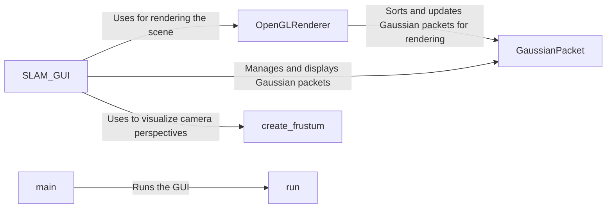

## Component Details

The GUI Visualization component provides a user interface for visualizing the SLAM process and the reconstructed 3D model. It displays the camera pose, map points, and other relevant information, allowing users to monitor and interact with the system. The SLAM_GUI is the central class, managing the UI and rendering. OpenGLRenderer handles the actual rendering using OpenGL, and GaussianPacket represents the Gaussian packets used in the splatting. Utility functions like create_frustum assist in visualizing camera perspectives. The run and main functions initiate the GUI application.

### SLAM_GUI
The main GUI class responsible for managing the user interface, displaying SLAM results, and handling user interactions. It initializes the GUI, adds camera perspectives, receives SLAM data, updates the scene, and renders it using OpenGL. It uses OpenGLRenderer for rendering and GaussianPacket for managing Gaussian packets.
- **Related Classes/Methods**: `src.gui.slam_gui.SLAM_GUI`

### OpenGLRenderer
Handles the OpenGL rendering of the SLAM scene. It initializes the OpenGL context, sorts and updates the Gaussian packets for rendering. It interacts with GaussianPacket to render the scene.
- **Related Classes/Methods**: `src.gui.gl_render.render_ogl.OpenGLRenderer`

### GaussianPacket
Represents a Gaussian packet, which is a fundamental element in Gaussian Splatting SLAM. It stores the packet's properties and provides methods for building its covariance matrix. It is used by SLAM_GUI and OpenGLRenderer.
- **Related Classes/Methods**: `src.gui.gui_utils.GaussianPacket`

### create_frustum
A utility function that creates a frustum representation for visualizing camera perspectives in the scene. It is used by SLAM_GUI to visualize camera perspectives.
- **Related Classes/Methods**: `src.gui.gui_utils.create_frustum`

### run
Function to run the GUI application.
- **Related Classes/Methods**: `src.gui.slam_gui.run`

### main
Main function to start the GUI application.
- **Related Classes/Methods**: `src.gui.slam_gui.main`
