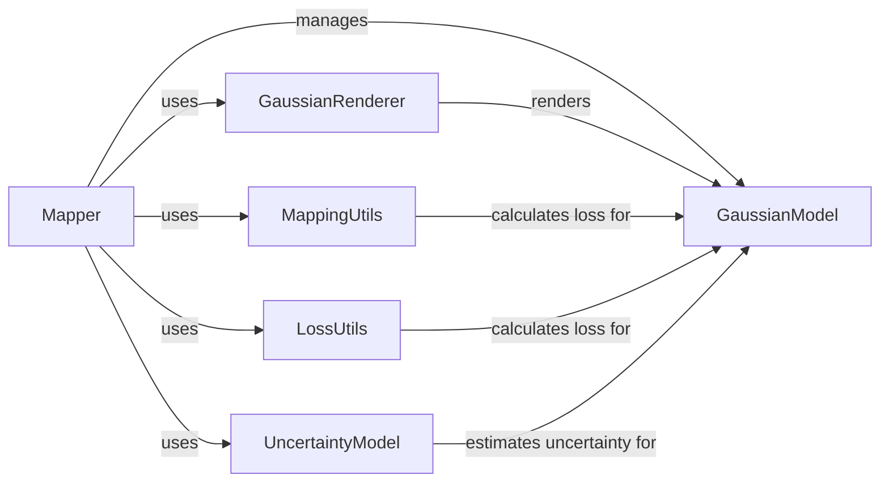

## Component Details

The Gaussian Splatting Mapping and Rendering subsystem is responsible for building and rendering a 3D map of the environment using Gaussian Splatting. The Mapper component orchestrates the process by integrating new keyframes, refining poses, and optimizing the Gaussian representation. The GaussianModel component manages the 3D Gaussians, while the GaussianRenderer component renders the scene from a given viewpoint. UncertaintyModel estimates uncertainty, and MappingUtils and LossUtils provide utility functions for optimization.

### Mapper
The Mapper class is the central component responsible for building and maintaining the map. It integrates new keyframes, refines poses, and optimizes the Gaussian representation of the scene. It uses GaussianModel to manage the 3D Gaussians, GaussianRenderer to render the scene, UncertaintyModel to estimate uncertainty, and MappingUtils and LossUtils for optimization.
- **Related Classes/Methods**: `src.mapper.Mapper`

### GaussianModel
The GaussianModel class manages the 3D Gaussian representation of the scene. It handles point creation, extension, pruning, densification, and saving/loading the point cloud. It is used by the Mapper for map optimization and GaussianRenderer for rendering.
- **Related Classes/Methods**: `thirdparty.gaussian_splatting.scene.gaussian_model.GaussianModel`

### GaussianRenderer
The GaussianRenderer is responsible for rendering the scene from a given viewpoint using the current Gaussian model and camera parameters. It interacts with GaussianModel to access the Gaussian representation and is used by the Mapper to generate images.
- **Related Classes/Methods**: `thirdparty.gaussian_splatting.gaussian_renderer`

### UncertaintyModel
The UncertaintyModel is responsible for generating uncertainty estimates, likely used in the loss calculations and visibility determination. It provides uncertainty estimates to the Mapper for optimization and visibility determination.
- **Related Classes/Methods**: `src.utils.dyn_uncertainty.uncertainty_model`

### MappingUtils
The MappingUtils module provides utility functions for computing SSIM components, mapping loss components, and DINO regularization loss, which are used in the optimization process. It provides loss components to the Mapper for optimization.
- **Related Classes/Methods**: `src.utils.dyn_uncertainty.mapping_utils`

### LossUtils
The LossUtils module provides utility functions for computing loss, including SSIM loss. It provides loss functions to the Mapper for optimization.
- **Related Classes/Methods**: `thirdparty.gaussian_splatting.utils.loss_utils`
