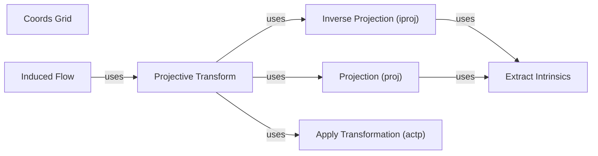

## Component Details

### Coords Grid
Generates a grid of coordinates, likely used for image processing or feature extraction. It creates a meshgrid of x and y coordinates based on the given height, width, and device. This grid can then be used as a base for further geometric computations or transformations.
- **Related Classes/Methods**: `src.geom.projective_ops.coords_grid`

### Inverse Projection (iproj)
Performs inverse projection using the pinhole camera model to convert depth maps into 3D point clouds. It takes depth values and intrinsic camera parameters as input, and outputs the corresponding 3D coordinates. This is a fundamental step in reconstructing 3D scenes from depth images.
- **Related Classes/Methods**: `src.geom.projective_ops.iproj`

### Projection (proj)
Performs projection using the pinhole camera model to convert 3D point clouds into 2D pixel coordinates. It takes 3D points and intrinsic camera parameters as input, and outputs the corresponding pixel locations. This is the inverse operation of inverse projection and is used for rendering 3D scenes.
- **Related Classes/Methods**: `src.geom.projective_ops.proj`

### Apply Transformation (actp)
Applies a transformation (SE3 or Sim3) to a 3D point cloud. It takes a transformation matrix and a 3D point cloud as input, and outputs the transformed point cloud. This is used to move or rotate point clouds in 3D space.
- **Related Classes/Methods**: `src.geom.projective_ops.actp`

### Projective Transform
Maps points from one image to another using projective transformations. It combines inverse projection, transformation, and projection to map points between images based on camera poses, depths, and intrinsics. This allows for the warping of images based on camera motion and scene geometry.
- **Related Classes/Methods**: `src.geom.projective_ops.projective_transform`

### Induced Flow
Computes the optical flow induced by camera motion. It uses projective transformation to calculate the flow vectors between images based on camera poses, depths, and intrinsics. This is used to estimate the motion of pixels between frames due to camera movement.
- **Related Classes/Methods**: `src.geom.projective_ops.induced_flow`

### Extract Intrinsics
Extracts intrinsic camera parameters (fx, fy, cx, cy) from an intrinsics tensor. These parameters define the camera's internal properties, such as focal length and principal point, and are essential for projection and inverse projection.
- **Related Classes/Methods**: `src.geom.projective_ops.extract_intrinsics`
