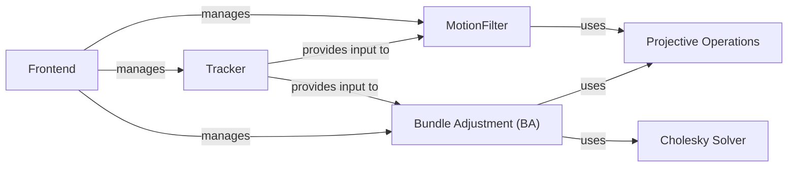

## Component Details

The Pose Estimation subsystem estimates the camera pose from input images. It initializes the pose using the Frontend, refines it with the MotionFilter, and tracks keyframes using the Tracker. Bundle Adjustment optimizes the pose and structure, relying on Projective Operations and Cholesky decomposition for geometric calculations and solving linear systems.

### Frontend
The Frontend component is responsible for initializing and managing the SLAM process. It orchestrates feature tracking, motion filtering, and bundle adjustment to provide an initial pose estimate. It acts as the entry point for pose estimation, managing the interaction between the tracker, motion filter, and bundle adjustment modules.
- **Related Classes/Methods**: `src.frontend.Frontend`

### MotionFilter
The MotionFilter component refines the estimated motion by removing outliers and smoothing the trajectory. It uses image features and projective operations to estimate and refine the motion, providing a more accurate pose estimate to the backend optimization and mapping components. It receives initial motion estimates from the Tracker.
- **Related Classes/Methods**: `src.motion_filter.MotionFilter`

### Tracker
The Tracker component is responsible for tracking features across frames. It detects and matches features, providing motion estimates for the motion filter and bundle adjustment. It manages keyframes and ensures robust pose tracking, providing essential data for pose estimation and mapping.
- **Related Classes/Methods**: `src.tracker.Tracker`

### Projective Operations
The Projective Operations component provides functions for performing projective transformations, including projection, inverse projection, and induced flow calculation. These operations are essential for geometric calculations in the SLAM system, used by both the MotionFilter and Bundle Adjustment components.
- **Related Classes/Methods**: `src.geom.projective_ops`

### Bundle Adjustment (BA)
The Bundle Adjustment component performs bundle adjustment to refine the estimated pose and structure. It minimizes the reprojection error between observed and predicted feature locations, using Cholesky decomposition to solve the normal equations. It receives feature tracks from the Tracker and uses Projective Operations for reprojection error calculation.
- **Related Classes/Methods**: `src.geom.ba`

### Cholesky Solver
The Cholesky Solver component provides functions for solving linear systems using Cholesky decomposition. This is used within bundle adjustment to solve the normal equations efficiently, contributing to the overall accuracy and performance of the pose estimation system.
- **Related Classes/Methods**: `src.geom.chol`
