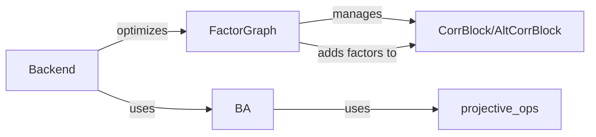

## Component Details

### FactorGraph
The FactorGraph class manages the graph of poses and landmarks, incorporating factors like proximity and neighborhood constraints. It's responsible for adding, removing, and updating factors, as well as managing keyframes. It uses CorrBlock or AltCorrBlock for feature correlation and projective_ops for geometric computations.
- **Related Classes/Methods**: `src.factor_graph.FactorGraph`

### Backend
The Backend class performs bundle adjustment (BA) to optimize the factor graph. It offers dense and loop BA functionalities, leveraging BA and FactorGraph for the core optimization process. It normalizes the video and updates the valid depth mask.
- **Related Classes/Methods**: `src.backend.Backend`

### BA
The BA class (and its variants like BA_with_scale_shift and MoBA) implements bundle adjustment algorithms. It uses projective transformations and safe scatter add operations to optimize the poses and landmarks in the factor graph. It also uses Cholesky decomposition to solve the linear systems that arise in the optimization.
- **Related Classes/Methods**: `src.geom.ba`

### projective_ops
The projective_ops module provides functions for performing projective transformations. It is used by the BA class to project 3D points into the camera frame.
- **Related Classes/Methods**: `src.geom.projective_ops`

### CorrBlock/AltCorrBlock
The CorrBlock and AltCorrBlock classes are responsible for computing the correlation between two images. They are used to add factors to the factor graph that constrain the relative poses of the images. AltCorrBlock is a low-memory implementation.
- **Related Classes/Methods**: `src.modules.droid_net.corr.CorrBlock`, `src.modules.droid_net.corr.AltCorrBlock`
