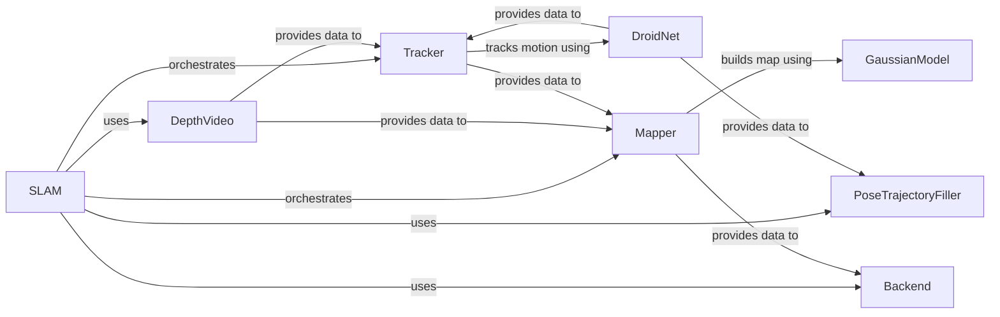

## Component Details

### SLAM
The SLAM class orchestrates the entire SLAM process, managing the tracking, mapping, and optimization stages. It initializes and connects the various components, including the Tracker, Mapper, DepthVideo, and PoseTrajectoryFiller, and manages the data flow between them. It also handles loading pretrained models and running the tracking and mapping processes in parallel, acting as the central control unit for the entire system.
- **Related Classes/Methods**: `src.slam.SLAM`

### Tracker
The Tracker component is responsible for estimating the camera pose and motion using visual and depth information. It receives data from the DroidNet and DepthVideo, interacts with the MotionFilter and Frontend to estimate camera poses, and provides pose estimates to the Mapper and PoseTrajectoryFiller.
- **Related Classes/Methods**: `src.tracker.Tracker`

### Mapper
The Mapper component builds and optimizes the map representation using Gaussian splatting. It receives data from the Tracker and DepthVideo, interacts with the GaussianModel, Camera, and SLAMUtils to build and refine the map, and provides the map to the Backend for optimization.
- **Related Classes/Methods**: `src.mapper.Mapper`

### DepthVideo
The DepthVideo component manages depth video data, including loading, saving, and processing. It provides depth and image data to the Tracker and Mapper, enabling them to perform tracking and mapping.
- **Related Classes/Methods**: `src.depth_video.DepthVideo`

### PoseTrajectoryFiller
The PoseTrajectoryFiller component fills in missing or noisy pose trajectory data. It uses the DroidNet and FactorGraph to refine the pose trajectory, providing a more complete and accurate pose trajectory for downstream tasks.
- **Related Classes/Methods**: `src.trajectory_filler.PoseTrajectoryFiller`

### DroidNet
The DroidNet component is a neural network for depth and optical flow estimation. It provides depth and optical flow information to the Tracker and PoseTrajectoryFiller, aiding in pose estimation and trajectory refinement.
- **Related Classes/Methods**: `src.modules.droid_net.droid_net.DroidNet`

### Backend
The Backend component performs global bundle adjustment to refine the map and camera poses. It receives data from the Mapper and PoseTrajectoryFiller, optimizes the map and poses, and provides the refined map and poses for visualization and other applications.
- **Related Classes/Methods**: `src.backend.Backend`

### GaussianModel
The GaussianModel component represents the 3D scene as a collection of Gaussian primitives. It is used by the Mapper to build and refine the map representation.
- **Related Classes/Methods**: `thirdparty.gaussian_splatting.scene.gaussian_model.GaussianModel`
