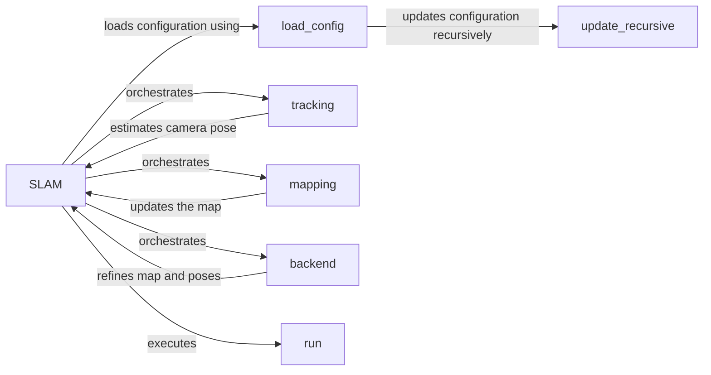

## Component Details

The SLAM Orchestrator manages the entire SLAM process, from configuration loading to backend optimization. It initializes and coordinates the tracking, mapping, and optimization steps within the SLAM loop. The orchestrator ensures data flows correctly between components and handles system startup, execution, and shutdown. It relies on a configuration file to set parameters for each stage of the SLAM pipeline.

### SLAM
The SLAM class orchestrates the entire SLAM process, including tracking, mapping, and backend optimization. It manages the Gaussian Splatting representation and interacts with the configuration and data loading components.
- **Related Classes/Methods**: `src.slam.SLAM`

### load_config
The `load_config` function is responsible for loading the configuration parameters from a file. These parameters control various aspects of the SLAM system, such as camera settings, optimization parameters, and data paths.
- **Related Classes/Methods**: `src.config:load_config`

### tracking
The `tracking` function estimates the camera pose based on the current frame and the existing map. It uses techniques like feature matching or direct image alignment to determine the camera's motion.
- **Related Classes/Methods**: `src.slam.SLAM:tracking`

### mapping
The `mapping` function updates the map based on the estimated camera pose and the current frame. It adds new Gaussian Splats to the map or refines the existing ones to represent the observed environment.
- **Related Classes/Methods**: `src.slam.SLAM:mapping`

### backend
The `backend` function performs global optimization to refine the map and camera poses. It minimizes the error between the predicted and observed measurements to create a consistent and accurate representation of the environment.
- **Related Classes/Methods**: `src.slam.SLAM:backend`

### run
The `run` function is the main entry point of the SLAM system. It initializes the system, loads the configuration, and executes the tracking, mapping, and backend optimization steps in a loop.
- **Related Classes/Methods**: `src.slam.SLAM:run`

### update_recursive
The `update_recursive` function recursively updates the configuration parameters with new values.
- **Related Classes/Methods**: `src.config:update_recursive`
