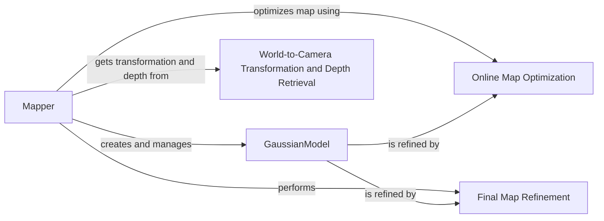

## Component Details

### Mapper
The Mapper class orchestrates the SLAM process by building and refining a map of the environment using Gaussian splatting. It initializes the mapping process, performs online optimization to refine the Gaussian representation based on new observations, and conducts a final refinement step to enhance the map's quality. The Mapper interacts with the GaussianModel to represent and manipulate the map, and it uses camera poses and depth information to update the map.
- **Related Classes/Methods**: `src.mapper.Mapper`

### GaussianModel
The GaussianModel class serves as the core data structure for representing the scene as a collection of 3D Gaussians. It provides functionalities for initializing the model, extending it from point clouds, pruning redundant points, densifying the model by adding new points, updating learning rates for optimization, and rendering the scene from different viewpoints. It is tightly coupled with the Mapper, which uses it to store and manipulate the map.
- **Related Classes/Methods**: `thirdparty.gaussian_splatting.scene.gaussian_model.GaussianModel`

### Online Map Optimization
The online map optimization refines the Gaussian representation of the map based on new observations. This process adjusts the parameters of the Gaussians to better align with the observed scene, improving the accuracy and completeness of the map. It is a key part of the Mapper's functionality, allowing it to adapt to changes in the environment in real-time.
- **Related Classes/Methods**: `src.mapper.Mapper.map_opt_online`

### Final Map Refinement
The final map refinement step is performed at the end of the SLAM process to further enhance the quality of the map. This may involve additional optimization or processing to reduce noise and improve the overall accuracy of the map. It is the last step in the Mapper's map-building process.
- **Related Classes/Methods**: `src.mapper.Mapper.final_refine`

### World-to-Camera Transformation and Depth Retrieval
This component is responsible for retrieving the transformation between the world coordinate system and the camera coordinate system, as well as obtaining depth information for each frame. This information is crucial for aligning the Gaussian representation with the observed scene and updating the map accordingly. It provides the necessary geometric information for the Mapper to function correctly.
- **Related Classes/Methods**: `src.mapper.Mapper.get_w2c_and_depth`
