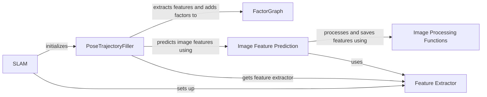

## Component Details

### SLAM
The SLAM class is the main entry point for the SLAM system. It initializes the PoseTrajectoryFiller and manages the overall SLAM process, orchestrating the pose trajectory refinement.
- **Related Classes/Methods**: `repos.WildGS-SLAM.src.slam.SLAM`

### PoseTrajectoryFiller
The PoseTrajectoryFiller class is responsible for filling the pose trajectory by extracting image features, encoding them, and adding factors to the factor graph. It uses image features and a Factor Graph to optimize the trajectory and ensure smoothness, providing a refined pose trajectory for the SLAM system.
- **Related Classes/Methods**: `repos.WildGS-SLAM.src.trajectory_filler.PoseTrajectoryFiller`

### Feature Extractor
The Feature Extractor component provides a function `get_feature_extractor` that returns a feature extractor model based on the configuration. It supports different feature extractors like DINOv2, enabling the system to adapt to various feature extraction methods.
- **Related Classes/Methods**: `src.utils.mono_priors.img_feature_extractors.get_feature_extractor`

### FactorGraph
The FactorGraph class represents the factor graph used for optimization in the SLAM system. It provides methods for adding factors and updating the graph, enabling the system to optimize the trajectory based on various constraints and measurements.
- **Related Classes/Methods**: `src.factor_graph.FactorGraph`

### Image Feature Prediction
The Image Feature Prediction component provides a function `predict_img_features` that predicts image features using a feature extractor model. It preprocesses the image, extracts features using the model, and saves the features to a file, facilitating the use of image features in the trajectory optimization process.
- **Related Classes/Methods**: `src.utils.mono_priors.img_feature_extractors.predict_img_features`

### Image Processing Functions
The Image Processing Functions component includes functions `process_image` and `_save_features` which handle image resizing, normalization, and saving of extracted features. These functions ensure that the images are properly prepared for feature extraction and that the extracted features are stored for later use.
- **Related Classes/Methods**: `src.utils.mono_priors.img_feature_extractors.predict_img_features`
