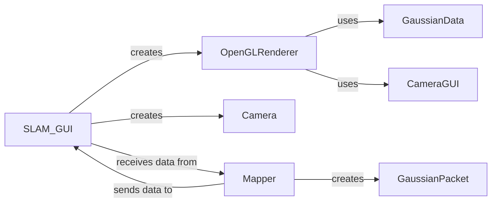

## Component Details

### SLAM_GUI
The main GUI class responsible for rendering the scene, handling user interactions, and receiving data from the SLAM backend. It initializes the GUI window, sets up the scene widget, and manages the rendering loop. It also handles user input events and updates the scene based on data received from the SLAM backend.
- **Related Classes/Methods**: `src.gui.slam_gui.SLAM_GUI`

### OpenGLRenderer
A class responsible for rendering Gaussian splats using OpenGL. It handles the OpenGL initialization, manages the Gaussian splat data, and performs the rendering operations. It interacts with the GaussianPacket to obtain the Gaussian splat data and renders it to the screen.
- **Related Classes/Methods**: `src.gui.gl_render.render_ogl.OpenGLRenderer`

### Camera
Represents a camera object, handling initialization from GUI parameters and updating its pose. It encapsulates the camera parameters, such as position, orientation, and field of view. It is used to control the camera in the GUI and to generate the view matrix for rendering.
- **Related Classes/Methods**: `src.utils.camera_utils.Camera`

### Mapper
The mapper component is responsible for building and refining the map. It sends data to the GUI for visualization. It interacts with the SLAM backend to obtain the map data and sends it to the GUI for rendering.
- **Related Classes/Methods**: `repos.WildGS-SLAM.src.mapper.Mapper`

### GaussianData
A class for managing Gaussian data in OpenGL. It stores the Gaussian splat data in a format that is suitable for rendering with OpenGL. It interacts with the OpenGLRenderer to update the Gaussian splat data and render it to the screen.
- **Related Classes/Methods**: `src.gui.gl_render.util_gau.GaussianData`

### CameraGUI
A class for managing the camera in the OpenGL renderer. It handles camera pose updates and provides methods for setting the camera parameters.
- **Related Classes/Methods**: `src.gui.gl_render.util.Camera`

### GaussianPacket
A data structure representing a Gaussian splat, used for visualization purposes. It encapsulates the Gaussian splat data, including position, scale, rotation, and features. It is used to transfer Gaussian splat data from the SLAM backend to the GUI for rendering.
- **Related Classes/Methods**: `src.gui.gui_utils.GaussianPacket`
