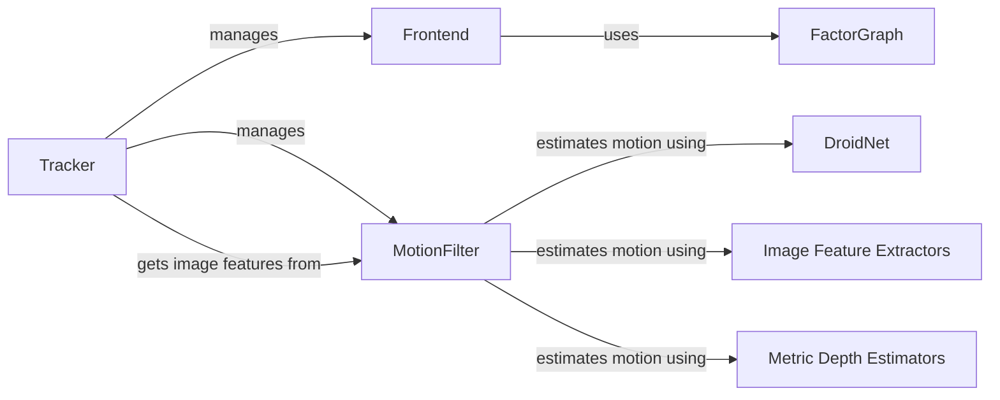

## Component Details

### Tracker
The Tracker class orchestrates the visual perception process by managing the Frontend and MotionFilter. It initializes these components, runs them to estimate the camera pose, and updates the map. The tracker is the central component that ties together the motion estimation and frontend optimization.
- **Related Classes/Methods**: `src.tracker.Tracker`

### Frontend
The Frontend class refines the camera pose and optimizes the local map. It extracts features, performs data association, and optimizes the map using a FactorGraph. The frontend is responsible for maintaining a consistent and accurate local map.
- **Related Classes/Methods**: `src.frontend.Frontend`

### FactorGraph
The FactorGraph class represents the optimization problem as a graph, allowing for efficient pose estimation and map refinement. It manages factors and keyframes, enabling the Frontend to optimize the map.
- **Related Classes/Methods**: `src.factor_graph.FactorGraph`

### MotionFilter
The MotionFilter class estimates the camera motion based on visual and inertial information. It uses image feature extractors and metric depth estimators to filter out outliers and provide a robust motion estimate to the Tracker.
- **Related Classes/Methods**: `src.motion_filter.MotionFilter`

### DroidNet
DroidNet is a neural network module that provides depth and motion estimation capabilities. It is used by the MotionFilter to enhance the accuracy of motion estimation, particularly in challenging scenarios.
- **Related Classes/Methods**: `src.modules.droid_net.droid_net.DroidNet`

### Image Feature Extractors
This module provides functionalities for extracting image features, which are crucial for visual tracking and motion estimation. It offers methods to obtain feature extractors and predict image features, enabling the system to identify and track salient points in the image sequence.
- **Related Classes/Methods**: `src.utils.mono_priors.img_feature_extractors`

### Metric Depth Estimators
This module provides functionalities for estimating metric depth from images, which is essential for 3D reconstruction and motion estimation. It offers methods to obtain metric depth estimators and predict metric depth, enabling the system to infer the distance to objects in the scene.
- **Related Classes/Methods**: `src.utils.mono_priors.metric_depth_estimators`
