```mermaid
graph LR
    SLAM_Core["SLAM Core"]
    Visual_Perception["Visual Perception"]
    Spatial_Mapping["Spatial Mapping"]
    Pose_Optimization["Pose Optimization"]
    Data_Management["Data Management"]
    Geometric_Computation["Geometric Computation"]
    Trajectory_Adjustment["Trajectory Adjustment"]
    User_Interface["User Interface"]
    SLAM_Core -- "manages" --> Visual_Perception
    SLAM_Core -- "manages" --> Spatial_Mapping
    SLAM_Core -- "manages" --> Pose_Optimization
    Visual_Perception -- "estimates pose using" --> Geometric_Computation
    Visual_Perception -- "estimates pose using" --> DNN_Modules
    Spatial_Mapping -- "builds map using" --> Data_Management
    Pose_Optimization -- "optimizes trajectory using" --> Pose_Optimization
    Data_Management -- "provides data to" --> SLAM_Core
    Geometric_Computation -- "performs transformations for" --> Visual_Perception
    Geometric_Computation -- "performs transformations for" --> Spatial_Mapping
    DNN_Modules -- "estimates depth and motion using" --> Visual_Perception
    Trajectory_Adjustment -- "refines trajectory using" --> Pose_Optimization
    User_Interface -- "visualizes using" --> SLAM_Core
    SLAM_Core -- "uses" --> Trajectory_Adjustment
    Visual_Perception -- "uses" --> Pose_Optimization
    Spatial_Mapping -- "uses" --> DNN_Modules
    Visual_Perception -- "refines pose using" --> Pose_Optimization
    click SLAM_Core href "https://github.com/CodeBoarding/GeneratedOnBoardings/blob/main/WildGS-SLAM/SLAM Core.md" "Details"
    click Visual_Perception href "https://github.com/CodeBoarding/GeneratedOnBoardings/blob/main/WildGS-SLAM/Visual Perception.md" "Details"
    click Spatial_Mapping href "https://github.com/CodeBoarding/GeneratedOnBoardings/blob/main/WildGS-SLAM/Spatial Mapping.md" "Details"
    click Pose_Optimization href "https://github.com/CodeBoarding/GeneratedOnBoardings/blob/main/WildGS-SLAM/Pose Optimization.md" "Details"
    click Data_Management href "https://github.com/CodeBoarding/GeneratedOnBoardings/blob/main/WildGS-SLAM/Data Management.md" "Details"
    click Geometric_Computation href "https://github.com/CodeBoarding/GeneratedOnBoardings/blob/main/WildGS-SLAM/Geometric Computation.md" "Details"
    click Trajectory_Adjustment href "https://github.com/CodeBoarding/GeneratedOnBoardings/blob/main/WildGS-SLAM/Trajectory Adjustment.md" "Details"
    click User_Interface href "https://github.com/CodeBoarding/GeneratedOnBoardings/blob/main/WildGS-SLAM/User Interface.md" "Details"
```

## Component Details

### SLAM Core
The SLAM Core orchestrates the entire SLAM process, managing the tracking, mapping, and optimization stages. It initializes and connects the various components, including the Visual Perception, Spatial Mapping, and Pose Optimization, and manages the data flow between them. It also handles the configuration and evaluation of the SLAM process, acting as the central control unit for the entire system.
- **Related Classes/Methods**: `src.slam.SLAM`, `src.config`

### Visual Perception
The Visual Perception module is responsible for estimating the camera pose by tracking visual features in the image sequence and providing visual information to the rest of the system. It uses a Motion Filter to predict the camera motion and a Frontend to refine the pose estimate. It also extracts image features for the mapping process. It encompasses functionalities for depth and motion estimation, uncertainty estimation, and feature extraction, leveraging neural networks and pre-trained models.
- **Related Classes/Methods**: `src.tracker.Tracker`, `src.motion_filter.MotionFilter`, `src.frontend.Frontend`, `src.modules.droid_net.droid_net.DroidNet`, `src.utils.mono_priors`, `src.utils.dyn_uncertainty`

### Spatial Mapping
The Spatial Mapping module is responsible for constructing and maintaining the map of the environment. It uses Gaussian Splatting to represent the map and refines it based on the camera poses and the image data. It also handles uncertainty estimation and visualization. It provides the spatial representation of the environment.
- **Related Classes/Methods**: `src.mapper.Mapper`, `thirdparty.gaussian_splatting.scene.gaussian_model.GaussianModel`

### Pose Optimization
The Pose Optimization module refines the camera poses and the map to ensure global consistency. It uses a Factor Graph to represent the SLAM problem and performs bundle adjustment to optimize the trajectory and the map. It ensures the accuracy and consistency of the estimated poses and map.
- **Related Classes/Methods**: `src.backend.Backend`, `src.factor_graph.FactorGraph`, `src.geom.ba`

### Data Management
The Data Management module handles the input image and depth data, providing access to the data and handling data synchronization and filtering. It also includes components for loading and accessing various datasets. It provides the raw data and preprocessed information to the SLAM system.
- **Related Classes/Methods**: `src.depth_video.DepthVideo`, `src.utils.datasets`

### Geometric Computation
The Geometric Computation module provides a set of functions for performing geometric transformations, such as projection and back-projection. It is used by various modules, including the Depth Video, Frontend, and Motion Filter. It provides the mathematical tools for geometric calculations.
- **Related Classes/Methods**: `src.geom.projective_ops`

### Trajectory Adjustment
The Trajectory Adjustment module fills in the pose trajectory by interpolating between keyframes. It uses image features and a Factor Graph to optimize the trajectory and ensure smoothness. It provides a refined and smooth pose trajectory for the SLAM system.
- **Related Classes/Methods**: `src.trajectory_filler.PoseTrajectoryFiller`

### User Interface
The User Interface module provides a graphical user interface for visualizing the SLAM process and the map. It allows users to interact with the system and control various parameters. It provides a way for users to monitor and control the SLAM system.
- **Related Classes/Methods**: `src.gui.slam_gui`