```mermaid
graph LR
    SLAM_Orchestrator["SLAM Orchestrator"]
    Data_Acquisition_and_Preprocessing["Data Acquisition and Preprocessing"]
    Pose_Estimation["Pose Estimation"]
    Backend_Optimization["Backend Optimization"]
    Gaussian_Splatting_Mapping_and_Rendering["Gaussian Splatting Mapping and Rendering"]
    GUI_Visualization["GUI Visualization"]
    SLAM_Orchestrator -- "manages" --> Data_Acquisition_and_Preprocessing
    SLAM_Orchestrator -- "manages" --> Pose_Estimation
    SLAM_Orchestrator -- "manages" --> Backend_Optimization
    SLAM_Orchestrator -- "manages" --> Gaussian_Splatting_Mapping_and_Rendering
    Data_Acquisition_and_Preprocessing -- "provides data to" --> Pose_Estimation
    Data_Acquisition_and_Preprocessing -- "provides data to" --> Gaussian_Splatting_Mapping_and_Rendering
    Pose_Estimation -- "estimates pose for" --> Backend_Optimization
    Pose_Estimation -- "estimates pose for" --> Gaussian_Splatting_Mapping_and_Rendering
    Backend_Optimization -- "optimizes" --> Gaussian_Splatting_Mapping_and_Rendering
    Gaussian_Splatting_Mapping_and_Rendering -- "renders scene in" --> GUI_Visualization
    click SLAM_Orchestrator href "https://github.com/CodeBoarding/GeneratedOnBoardings/blob/main/WildGS-SLAM/SLAM Orchestrator.md" "Details"
    click Data_Acquisition_and_Preprocessing href "https://github.com/CodeBoarding/GeneratedOnBoardings/blob/main/WildGS-SLAM/Data Acquisition and Preprocessing.md" "Details"
    click Pose_Estimation href "https://github.com/CodeBoarding/GeneratedOnBoardings/blob/main/WildGS-SLAM/Pose Estimation.md" "Details"
    click Backend_Optimization href "https://github.com/CodeBoarding/GeneratedOnBoardings/blob/main/WildGS-SLAM/Backend Optimization.md" "Details"
    click Gaussian_Splatting_Mapping_and_Rendering href "https://github.com/CodeBoarding/GeneratedOnBoardings/blob/main/WildGS-SLAM/Gaussian Splatting Mapping and Rendering.md" "Details"
    click GUI_Visualization href "https://github.com/CodeBoarding/GeneratedOnBoardings/blob/main/WildGS-SLAM/GUI Visualization.md" "Details"
```

## Component Details

WildGS-SLAM is a system for simultaneous localization and mapping (SLAM) that uses Gaussian Splatting for map representation and rendering. The system integrates data input and preprocessing, pose estimation, backend optimization, mapping, and rendering to create a 3D model of the environment and track the camera pose. The SLAM Orchestrator manages the overall process, coordinating the different components and ensuring smooth operation.

### SLAM Orchestrator
The SLAM Orchestrator is the central control unit of the system. It initializes and manages all other components, orchestrating the data flow and processing steps required for SLAM. It loads configurations, starts the main SLAM loop, and handles termination and evaluation. It is responsible for the overall system coordination and control.
- **Related Classes/Methods**: `src.slam.SLAM`, `src.config`

### Data Acquisition and Preprocessing
This component handles the acquisition and preprocessing of input data, including depth and RGB images. It manages datasets, applies monocular depth priors, and performs necessary preprocessing steps such as depth upsampling, normalization, reprojection, and filtering. It provides clean and usable data to the pose estimation and mapping components.
- **Related Classes/Methods**: `src.depth_video.DepthVideo`, `src.utils.datasets`, `src.utils.mono_priors`

### Pose Estimation
The Pose Estimation component is responsible for estimating the camera pose from the input images. It uses a frontend for initial pose estimation, a motion filter for refining the pose, and a tracker for managing keyframes and ensuring robust pose tracking. It provides pose estimates to the backend optimization and mapping components.
- **Related Classes/Methods**: `src.frontend.Frontend`, `src.motion_filter.MotionFilter`, `src.tracker.Tracker`, `src.geom.projective_ops`, `src.geom.ba`, `src.geom.chol`

### Backend Optimization
The Backend Optimization component refines the camera poses and map using factor graph optimization. It constructs a factor graph from visual odometry and loop closure constraints, and then optimizes the graph to minimize the error. It uses pose trajectory management to fill in poses for non-keyframes. This component improves the accuracy and consistency of the SLAM results.
- **Related Classes/Methods**: `src.factor_graph.FactorGraph`, `src.backend.Backend`, `src.trajectory_filler.PoseTrajectoryFiller`

### Gaussian Splatting Mapping and Rendering
This component builds and renders the 3D map using Gaussian Splatting. It updates keyframes, mapping points, and visibility information. It also performs map optimization and incorporates dynamic uncertainty estimation. The rendering part takes the Gaussian Splatting representation and camera parameters as input and generates an image.
- **Related Classes/Methods**: `src.mapper.Mapper`, `src.utils.dyn_uncertainty`, `thirdparty.gaussian_splatting.gaussian_renderer`, `thirdparty.gaussian_splatting.scene.gaussian_model.GaussianModel`

### GUI Visualization
The GUI Visualization component provides a user interface for visualizing the SLAM process and the reconstructed 3D model. It displays the camera pose, map points, and other relevant information, allowing users to monitor and interact with the system.
- **Related Classes/Methods**: `src.gui.slam_gui`