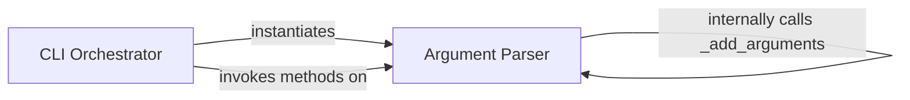

## Details

The `CLI Interface & Orchestrator` subsystem serves as the application's primary entry point, managing command-line argument parsing and orchestrating the overall execution flow of the XKCD password generator.

### CLI Orchestrator
This is the application's core entry point and central orchestrator. It is responsible for initializing the application context, parsing command-line arguments, and then directing the overall execution flow. This includes invoking subsequent components for tasks such as generating wordlists, validating options, handling interactive runs, generating reports, and ultimately outputting the generated passwords.

**Related Classes/Methods**:

- <a href="https://github.com/redacted/XKCD-password-generator/blob/master/xkcdpass/xkcd_password.py#L529-L561" target="_blank" rel="noopener noreferrer">`xkcdpass.xkcd_password.main`:529-561</a>

### Argument Parser
A specialized extension of `argparse.ArgumentParser`, this component is dedicated to defining, parsing, and managing all command-line arguments specific to the XKCD password generator. Its constructor (`__init__`) sets up the argument definitions by calling the internal `_add_arguments` method, which encapsulates the complete set of available command-line options. It provides a structured and user-friendly interface for input.

**Related Classes/Methods**:

- <a href="https://github.com/redacted/XKCD-password-generator/blob/master/xkcdpass/xkcd_password.py#L435-L526" target="_blank" rel="noopener noreferrer">`xkcdpass.xkcd_password.XkcdPassArgumentParser`:435-526</a>
- <a href="https://github.com/redacted/XKCD-password-generator/blob/master/xkcdpass/xkcd_password.py#L438-L441" target="_blank" rel="noopener noreferrer">`xkcdpass.xkcd_password.XkcdPassArgumentParser:__init__`:438-441</a>
- <a href="https://github.com/redacted/XKCD-password-generator/blob/master/xkcdpass/xkcd_password.py#L443-L526" target="_blank" rel="noopener noreferrer">`xkcdpass.xkcd_password.XkcdPassArgumentParser:_add_arguments`:443-526</a>

### [FAQ](https://github.com/CodeBoarding/GeneratedOnBoardings/tree/main?tab=readme-ov-file#faq)