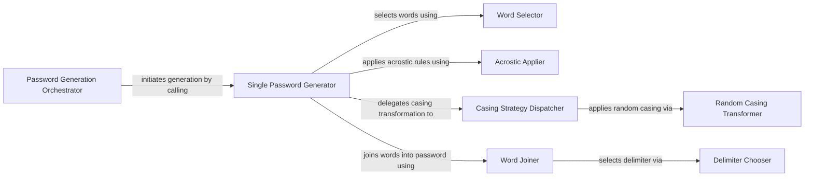

## Details

The Password Generation Core subsystem is responsible for the primary business logic of generating XKCD-style passwords. This includes the selection of words, integration of acrostics, application of various casing rules, and the final assembly of the password string.

### Password Generation Orchestrator
This component serves as the top-level public interface for initiating the generation of one or more XKCD-style passwords. It orchestrates the overall process by delegating the creation of individual passwords to the Single Password Generator.

**Related Classes/Methods**:

- <a href="https://github.com/redacted/XKCD-password-generator/blob/master/xkcdpass/xkcd_password.py" target="_blank" rel="noopener noreferrer">`xkcdpass.xkcd_password:generate_xkcdpassword`</a>

### Single Password Generator
This is the core logic unit responsible for assembling a single password. It coordinates the sequence of operations: selecting words, applying acrostic rules, transforming word casing, and finally joining the words.

**Related Classes/Methods**:

- <a href="https://github.com/redacted/XKCD-password-generator/blob/master/xkcdpass/xkcd_password.py" target="_blank" rel="noopener noreferrer">`xkcdpass.xkcd_password:gen_passwd`</a>

### Word Selector
Responsible for choosing the required number of words from a given wordlist, forming the foundational elements of the password.

**Related Classes/Methods**:

- <a href="https://github.com/redacted/XKCD-password-generator/blob/master/xkcdpass/xkcd_password.py" target="_blank" rel="noopener noreferrer">`xkcdpass.xkcd_password:choose_words`</a>

### Acrostic Applier
This component applies acrostic constraints to the selected words. It ensures that the chosen words align with a specified initial letter pattern, if an acrostic is provided.

**Related Classes/Methods**:

- <a href="https://github.com/redacted/XKCD-password-generator/blob/master/xkcdpass/xkcd_password.py" target="_blank" rel="noopener noreferrer">`xkcdpass.xkcd_password:find_acrostic`</a>

### Casing Strategy Dispatcher
Manages and dispatches various casing rules (e.g., random, alternating, first upper, lower, capitalize) to the chosen words based on configuration. It acts as a central point for applying different casing transformations.

**Related Classes/Methods**:

- <a href="https://github.com/redacted/XKCD-password-generator/blob/master/xkcdpass/xkcd_password.py" target="_blank" rel="noopener noreferrer">`xkcdpass.xkcd_password:set_case`</a>
- <a href="https://github.com/redacted/XKCD-password-generator/blob/master/xkcdpass/xkcd_password.py" target="_blank" rel="noopener noreferrer">`xkcdpass.xkcd_password:alternating_case`</a>
- <a href="https://github.com/redacted/XKCD-password-generator/blob/master/xkcdpass/xkcd_password.py" target="_blank" rel="noopener noreferrer">`xkcdpass.xkcd_password:first_upper_case`</a>
- <a href="https://github.com/redacted/XKCD-password-generator/blob/master/xkcdpass/xkcd_password.py" target="_blank" rel="noopener noreferrer">`xkcdpass.xkcd_password:lower_case`</a>
- <a href="https://github.com/redacted/XKCD-password-generator/blob/master/xkcdpass/xkcd_password.py" target="_blank" rel="noopener noreferrer">`xkcdpass.xkcd_password:capitalize_case`</a>

### Random Casing Transformer
This component transforms words by randomly applying uppercase or lowercase to individual characters, introducing variability and enhancing password strength.

**Related Classes/Methods**:

- <a href="https://github.com/redacted/XKCD-password-generator/blob/master/xkcdpass/xkcd_password.py" target="_blank" rel="noopener noreferrer">`xkcdpass.xkcd_password:random_case`</a>
- <a href="https://github.com/redacted/XKCD-password-generator/blob/master/xkcdpass/xkcd_password.py" target="_blank" rel="noopener noreferrer">`xkcdpass.xkcd_password:make_upper`</a>

### Word Joiner
Responsible for concatenating the processed words into the final password string. It can incorporate a randomly selected delimiter to further enhance password complexity.

**Related Classes/Methods**:

- <a href="https://github.com/redacted/XKCD-password-generator/blob/master/xkcdpass/xkcd_password.py" target="_blank" rel="noopener noreferrer">`xkcdpass.xkcd_password:randomized_delimiter_join`</a>

### Delimiter Chooser
Selects a random delimiter from a predefined set of options. This delimiter is then used by the Word Joiner to separate words in the final password.

**Related Classes/Methods**:

- <a href="https://github.com/redacted/XKCD-password-generator/blob/master/xkcdpass/xkcd_password.py" target="_blank" rel="noopener noreferrer">`xkcdpass.xkcd_password:choose_delimiter`</a>

### [FAQ](https://github.com/CodeBoarding/GeneratedOnBoardings/tree/main?tab=readme-ov-file#faq)