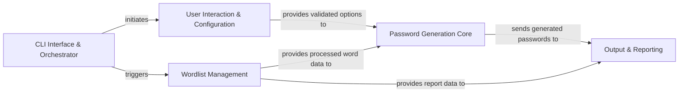

## Details

The `XKCD-password-generator` project follows a modular, pipeline-oriented architecture, primarily driven by its CLI interface. The `CLI Interface & Orchestrator` serves as the central control, initiating the process by parsing arguments and coordinating subsequent steps. It first engages the `User Interaction & Configuration` component for input validation and interactive prompts. Simultaneously, the `Wordlist Management` component handles the crucial task of loading and preparing wordlists. Both the validated configuration and the processed wordlists are then consumed by the `Password Generation Core`, which encapsulates all the complex logic for selecting words, applying various transformations (like casing), and assembling the final password. Finally, the generated passwords, along with any verbose reports from wordlist processing, are passed to the `Output & Reporting` component for display to the user. This clear separation of concerns facilitates maintainability and allows for a straightforward data and control flow, ideal for visual representation.

### CLI Interface & Orchestrator [[Expand]](./CLI_Interface_Orchestrator.md)
The application's entry point, responsible for parsing command-line arguments, initializing the application context, and orchestrating the overall execution flow.

**Related Classes/Methods**:

- <a href="https://github.com/redacted/XKCD-password-generator/blob/master/xkcdpass/xkcd_password.py#L529-L561" target="_blank" rel="noopener noreferrer">`main`:529-561</a>
- <a href="https://github.com/redacted/XKCD-password-generator/blob/master/xkcdpass/xkcd_password.py#L435-L526" target="_blank" rel="noopener noreferrer">`XkcdPassArgumentParser`:435-526</a>
- <a href="https://github.com/redacted/XKCD-password-generator/blob/master/xkcdpass/xkcd_password.py#L438-L441" target="_blank" rel="noopener noreferrer">`__init__`:438-441</a>
- <a href="https://github.com/redacted/XKCD-password-generator/blob/master/xkcdpass/xkcd_password.py#L443-L526" target="_blank" rel="noopener noreferrer">`_add_arguments`:443-526</a>

### User Interaction & Configuration
Manages user input, handles interactive prompts, and validates the provided options and parameters.

**Related Classes/Methods**:

- <a href="https://github.com/redacted/XKCD-password-generator/blob/master/xkcdpass/xkcd_password.py#L69-L78" target="_blank" rel="noopener noreferrer">`validate_options`:69-78</a>
- <a href="https://github.com/redacted/XKCD-password-generator/blob/master/xkcdpass/xkcd_password.py#L208-L222" target="_blank" rel="noopener noreferrer">`try_input`:208-222</a>
- <a href="https://github.com/redacted/XKCD-password-generator/blob/master/xkcdpass/xkcd_password.py#L388-L409" target="_blank" rel="noopener noreferrer">`initialize_interactive_run`:388-409</a>

### Wordlist Management
Encapsulates the logic for locating, loading, and preprocessing raw wordlists, preparing them for password generation.

**Related Classes/Methods**:

- <a href="https://github.com/redacted/XKCD-password-generator/blob/master/xkcdpass/xkcd_password.py#L81-L105" target="_blank" rel="noopener noreferrer">`locate_wordfile`:81-105</a>
- <a href="https://github.com/redacted/XKCD-password-generator/blob/master/xkcdpass/xkcd_password.py#L108-L135" target="_blank" rel="noopener noreferrer">`generate_wordlist`:108-135</a>
- <a href="https://github.com/redacted/XKCD-password-generator/blob/master/xkcdpass/xkcd_password.py#L138-L153" target="_blank" rel="noopener noreferrer">`wordlist_to_worddict`:138-153</a>

### Password Generation Core [[Expand]](./Password_Generation_Core.md)
Contains the primary business logic for generating XKCD-style passwords, including word selection, acrostic integration, applying various casing rules, and assembling the final password string.

**Related Classes/Methods**:

- <a href="https://github.com/redacted/XKCD-password-generator/blob/master/xkcdpass/xkcd_password.py#L321-L367" target="_blank" rel="noopener noreferrer">`generate_xkcdpassword`:321-367</a>
- <a href="https://github.com/redacted/XKCD-password-generator/blob/master/xkcdpass/xkcd_password.py#L339-L347" target="_blank" rel="noopener noreferrer">`gen_passwd`:339-347</a>
- <a href="https://github.com/redacted/XKCD-password-generator/blob/master/xkcdpass/xkcd_password.py#L200-L205" target="_blank" rel="noopener noreferrer">`choose_words`:200-205</a>
- <a href="https://github.com/redacted/XKCD-password-generator/blob/master/xkcdpass/xkcd_password.py#L182-L197" target="_blank" rel="noopener noreferrer">`find_acrostic`:182-197</a>
- <a href="https://github.com/redacted/XKCD-password-generator/blob/master/xkcdpass/xkcd_password.py#L298-L318" target="_blank" rel="noopener noreferrer">`set_case`:298-318</a>
- <a href="https://github.com/redacted/XKCD-password-generator/blob/master/xkcdpass/xkcd_password.py#L270-L284" target="_blank" rel="noopener noreferrer">`random_case`:270-284</a>
- <a href="https://github.com/redacted/XKCD-password-generator/blob/master/xkcdpass/xkcd_password.py#L232-L239" target="_blank" rel="noopener noreferrer">`alternating_case`:232-239</a>
- <a href="https://github.com/redacted/XKCD-password-generator/blob/master/xkcdpass/xkcd_password.py#L256-L260" target="_blank" rel="noopener noreferrer">`first_upper_case`:256-260</a>
- <a href="https://github.com/redacted/XKCD-password-generator/blob/master/xkcdpass/xkcd_password.py#L249-L253" target="_blank" rel="noopener noreferrer">`lower_case`:249-253</a>
- <a href="https://github.com/redacted/XKCD-password-generator/blob/master/xkcdpass/xkcd_password.py#L263-L267" target="_blank" rel="noopener noreferrer">`capitalize_case`:263-267</a>
- <a href="https://github.com/redacted/XKCD-password-generator/blob/master/xkcdpass/xkcd_password.py#L274-L282" target="_blank" rel="noopener noreferrer">`make_upper`:274-282</a>
- <a href="https://github.com/redacted/XKCD-password-generator/blob/master/xkcdpass/xkcd_password.py#L370-L378" target="_blank" rel="noopener noreferrer">`randomized_delimiter_join`:370-378</a>
- <a href="https://github.com/redacted/XKCD-password-generator/blob/master/xkcdpass/xkcd_password.py#L381-L385" target="_blank" rel="noopener noreferrer">`choose_delimiter`:381-385</a>

### Output & Reporting
Responsible for formatting and displaying the generated passwords to the user, and providing verbose reporting if enabled.

**Related Classes/Methods**:

- <a href="https://github.com/redacted/XKCD-password-generator/blob/master/xkcdpass/xkcd_password.py#L412-L432" target="_blank" rel="noopener noreferrer">`emit_passwords`:412-432</a>
- <a href="https://github.com/redacted/XKCD-password-generator/blob/master/xkcdpass/xkcd_password.py#L156-L179" target="_blank" rel="noopener noreferrer">`verbose_reports`:156-179</a>

### [FAQ](https://github.com/CodeBoarding/GeneratedOnBoardings/tree/main?tab=readme-ov-file#faq)